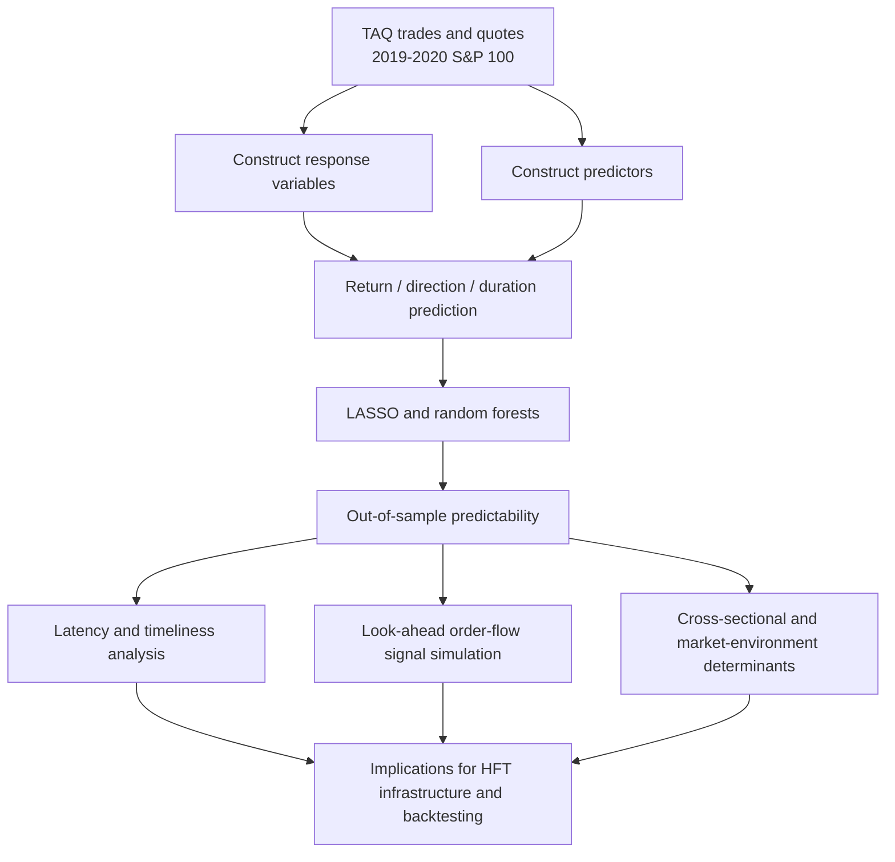
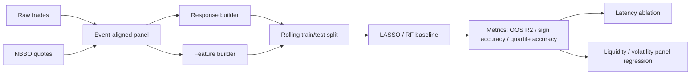

# 中文精读导读

## 一句话定位

这篇文章不是在证明某个高频交易策略能赚钱，而是在系统回答：在毫秒到数分钟尺度上，基于 TAQ trades 和 quotes，未来短期收益、方向和事件 duration 到底有多可预测，这种可预测性在什么 horizon、什么数据时效、什么市场环境下存在或消失。

## 为什么值得读

它和高频回测、短线量化、订单簿研究的连接点很直接：

- 目标变量不是日频收益，而是 5 秒、30 秒、10/200 笔交易、1000/20000 股成交量等 ultra-short horizon response。
- 特征来自 trades 和 quotes，包括 transaction imbalance、past return、LOB imbalance、spread、realized volatility、turnover 等。
- 模型用 LASSO 和 random forests，不是深度学习黑箱，适合还原成可实现的 baseline。
- 重点讨论 latency：最近 10 milliseconds、10 transactions、10 lots 对预测力贡献很大，100 ms 级别延迟会显著伤害结果。
- 它明确区分 predictability 和 profitability，提醒我们不能把预测 \(R^2\) 或方向准确率直接等同于可交易收益。

## 文章主线

## 核心定义

文章把一个时点 \(T\)、一个 forward span \(\Delta\)、一个 clock mode \(M\) 组合起来定义预测目标。

核心 response 分三类：

- Transaction return：未来短窗口内成交价平均相对当前 mid-price 的 return。
- Direction：transaction return 是否为正。
- Duration：达到未来 \(\Delta\) 笔交易或 \(\Delta\) 股成交量所需的 calendar time。

这对应三种工程任务：

| 数学对象 | 工程表示 | 回测含义 |
| --- | --- | --- |
| \(T\) | 当前 market event timestamp | 策略决策时间 |
| \(\Delta\) | 5s、30s、10 trades、200 trades、1000 lots 等 | 预测 horizon |
| \(M\) | calendar / transaction / volume clock | 事件时间或成交量时间 |
| Return | float target | 短窗口收益回归 |
| Direction | binary target | 多空/撤单方向信号 |
| Duration | positive time target | 成交强度、排队风险、撤单节奏 |

## 关键实证结论

需要优先记住这些数字：

- 中位股票 5 秒 return prediction 的 out-of-sample \(R^2\) 约为 10.5%。
- 下一笔 trade direction prediction accuracy 约为 64%。
- 预测 next 10 trades duration 的中位 out-of-sample \(R^2\) 约为 9.8%。
- return predictability 大约在 5 分钟、约 2000 笔交易或约 2000 lots 后衰减到接近 0。
- 约 80% 的总体预测力来自最近 10 milliseconds、10 transactions 或 10 lots。
- 如果加入一个 imperfect look-ahead order-flow sign signal，5 秒 return \(R^2\) 可从约 14.0% 提升到 27.1%，方向准确率可从 68.3% 提升到 79.0%。

这些数字的意义不是“直接可套利”，而是说明：高频尺度下确实存在可测量的、短寿命的、强依赖数据新鲜度的统计信号。

## 最值得精读的章节

| 顺序 | 章节 | 读什么 |
| --- | --- | --- |
| 1 | Section 2.1 | response variables 和 clocks，决定如何构造 label |
| 2 | Section 2.1.3 | predictor groups，决定 feature engineering |
| 3 | Section 2.2.3 / Appendix G.3 | rolling training/tuning/testing window，决定回测切分方式 |
| 4 | Section 3 | 单股票预测结果和变量重要性 |
| 5 | Section 4 | latency、timeliness、look-ahead order-flow signal |
| 6 | Section 5 | 为什么不同股票、不同市场状态下可预测性不同 |
| 7 | Appendix F | trades-only vs quotes-only、树数量、相关股票增量信息等 robustness |

## 实现映射

如果要把它转成本地研究代码，最小 baseline 可以这样拆：

最小实现不应一开始追求完整论文复现，而应先做一个单 ticker、单日期或小窗口版本：

- 输入：trade records、NBBO quote records。
- 对齐：对每个 event timestamp 找到当时 latest quote。
- Label：先做 5 秒 future transaction return 和 direction。
- Feature：先做 PastReturn、TxnImbalance、LobImbalance、QuotedSpread。
- Split：按时间滚动，严禁随机打乱。
- Metric：先做 out-of-sample \(R^2\) 和 sign accuracy。
- Ablation：加入 10 ms、100 ms、1 s delay，检查性能衰减。

## 和你当前 ai4trading 项目的关系

这篇文章可以作为 `crypto-high-frequency-trading` 与 Databento/LOB 研究之间的桥：

- 对 Databento/美股 LOB：它给出 TAQ level-1 trades/quotes 的可预测性 baseline。
- 对 crypto 高频：它提供了如何定义 event-time horizon、duration target 和 latency degradation 的模板。
- 对回测系统：它强调 label construction、rolling retraining、时序验证和 delay ablation，比直接上复杂策略更基础。
- 对 agent 交易：它支持“AI 先做研究和风控，不直接触发实盘下单”的原则，因为从 predictability 到 profitability 中间还有很多执行层约束。

## 精读时要警惕的点

- TAQ 是 level-1 quote，不是完整 depth-of-book。若迁移到 full LOB，特征空间和 queue dynamics 会变。
- 论文用的是 predictability metric，不是 net PnL。任何策略化都必须加入 fees、spread crossing、slippage、latency、queue position 和 inventory risk。
- Direction accuracy 高并不等于收益高，因为错在大波动时可能远比对在小波动时更贵。
- \(R^2\) 对 fat-tail response 不稳，文中也用 direction accuracy 和 quartile accuracy 做补充。
- Rolling retraining 是核心，不是可选细节；高频信号半衰期短，静态模型容易过拟合旧 regime。
- “look-ahead” 模拟不是现实可直接获得的信号，它更像一个上界实验，用来量化 order-flow preview 的价值。

## 下一步研究问题

- 用 Databento 小样本复现一个 5 秒 return / direction baseline。
- 对比 calendar clock、transaction clock、volume clock 哪个对你的数据更稳。
- 做 delay ablation：无延迟、10 ms、100 ms、1 s、5 s。
- 做 trades-only vs quotes-only，对应论文 Appendix F.2。
- 如果迁移到 crypto，优先检查交易所撮合规则、手续费、maker/taker、WebSocket 延迟和 order book snapshot consistency。
