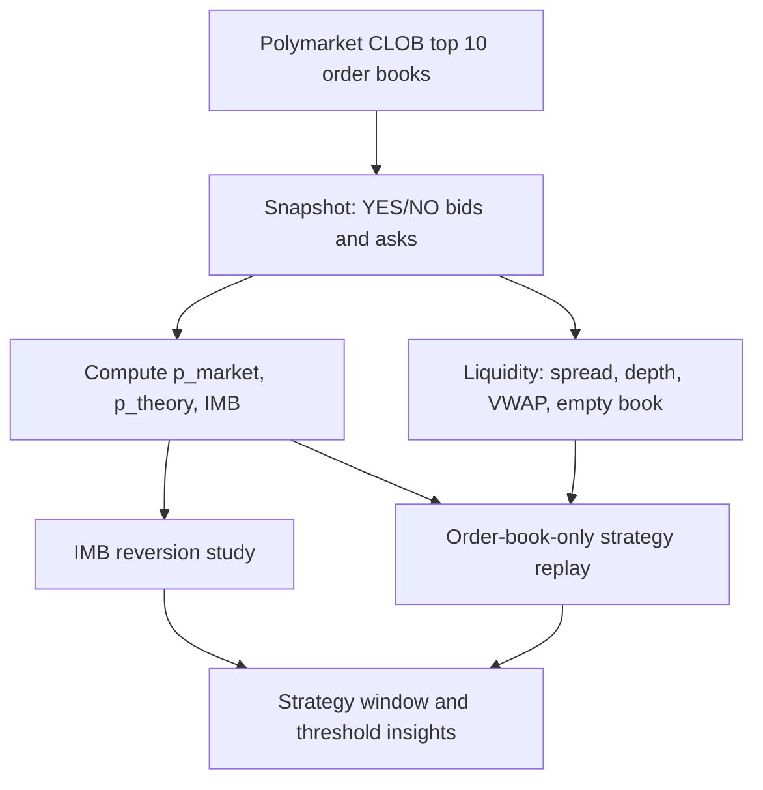

# Polybot Order Book Snapshot Insights - 2026-07-06

对象：香港 VPS `/opt/polybot/data/polybot.db` 的 `orderbook_snapshots`、`decisions`、`trades`。
本报告只读分析数据，没有修改 VPS 上正在运行的 Polybot 服务。

## Executive Summary

当前 `orderbook_snapshots` 已经足够支持几天到十几天级别的探索性回放：本次主回放固定读取了 `1,412,850` 条订单簿快照，覆盖 `3,186` 个 BTC 5 分钟市场，时间范围约为 2026-06-23 22:35:11 CST 到 2026-07-06 00:53:42 CST。数据库仍在继续写入，所以后续数字会继续增长。

最重要的发现：

1. Polymarket 盘口本身大多数时间是有效的。YES/NO mid 基本互补，median spread 是 `0.01`，所以不是“取错市场”导致的异常。
2. 大 IMB 很多出现在市场后段，尤其最后 60 秒；这段盘口深度塌缩、单边盘口变多，大量 IMB 是“看起来很大，但目标方向根本不可交易”。
3. $ |IMB| \ge 18\% $ 后确实有短期赔率回归，但主要在市场前中段；240 秒以后信号明显变差，最后 30 秒尤其危险。
4. 按订单簿 top 10 深度做可成交回放，当前 18% IMB 阈值如果无差别交易，会被 270-300 秒区间严重拖累。
5. 对 Strategy 1 来说，下一步更应该优化“可交易 IMB”和时间窗口，而不是只盯 raw IMB 阈值。

## 数据和方法

订单簿快照字段包括：

- `yes_bids_json` / `yes_asks_json`
- `no_bids_json` / `no_asks_json`
- `p_market`
- `p_theory`
- `imbalance`
- `elapsed_sec` / `remain_sec`

策略方向定义：

$$
IMB = p_{market} - p_{theory}
$$

- $ IMB > 0 $：市场给 Up 的概率高于模型理论值，Up 偏贵，策略买 `NO`。
- $ IMB < 0 $：市场给 Up 的概率低于模型理论值，Up 偏便宜，策略买 `YES`。

订单簿回放用的是更接近真实 paper trader 的模型：

- 开仓：吃目标方向 ask，用 top 10 asks 算 VWAP。
- 平仓：打目标方向 bid，用 top 10 bids 算 VWAP。
- 费用：使用当前代码里的 Polymarket crypto taker fee 曲线。
- 止盈止损：`take_profit = 18%`，`stop_loss = 16%`。
- 入场窗口：`45s-290s`。
- 仓位：账户 equity 的 `2%`。

注意：本报告里的“订单簿回放”不是完全等同于线上 Strategy 1，因为它没有完整复现 Binance taker flow、实时 requote、API 延迟、历史分布刷新等所有状态。它适合发现结构性规律，不应该直接当成最终收益承诺。

## 盘口质量

### YES/NO 是否一致

有效双边盘口里，YES 和 NO 的 mid price 基本互补：

| 指标 | 结果 |
|---|---:|
| $ |YES_{mid} + NO_{mid} - 1| \le 0.01 $ | `98.77%` |
| $ |YES_{mid} + NO_{mid} - 1| \le 0.02 $ | `99.63%` |
| 误差大于 `0.05` | `0.048%` |
| 买双边 ask sum < 1 | `0.095%` |
| 卖双边 bid sum > 1 | `0.101%` |

解释：Polymarket CLOB 的 YES/NO 盘口大多数时候是自洽的。异常 IMB 主要不是因为市场源错了，而是因为后段盘口单边、深度不足、或理论值和市场尾部价格发生极端分叉。

### Spread

| 指标 | YES spread | NO spread |
|---|---:|---:|
| mean | `0.01119` | `0.01119` |
| median | `0.01` | `0.01` |
| p95 | `0.02` | `0.02` |
| p99 | `0.04` | `0.04` |

解释：正常时期价差并不宽，主要成本不是单纯 spread，而是 spread + taker fee + VWAP 滑点 + 后段单边风险。

### Top 10 深度

整体 top 10 USD 深度中位数：

| 方向 | Bid depth | Ask depth |
|---|---:|---:|
| YES | 约 `$1,431` | 约 `$1,714` |
| NO | 约 `$1,466` | 约 `$1,745` |

但是深度随临近结算明显塌缩：

| elapsed | 盘口状态 |
|---|---|
| 前 1 分钟 | ask depth median 约 `$2,000-$2,300` |
| 240-269s | ask depth median 降到约 `$515-$545` |
| 270-299s | ask depth median 降到约 `$250` |

这解释了为什么最后几十秒 raw IMB 经常很大，但实际成交质量很差。

## 高 IMB 是否可交易

本次主回放中，$ |IMB| \ge 18\% $ 的 snapshot 约 `206,789` 条，占全部快照约 `14.64%`。

高 IMB snapshot 的盘口可交易性：

| 分类 | 条数 | 占比 |
|---|---:|---:|
| 目标方向盘口为空或单边 | `92,123` | `44.55%` |
| 通过基础盘口检查，可视为 book-tradeable | `52,726` | `25.50%` |
| 超出入场窗口后段 | `36,006` | `17.41%` |
| OBI veto | `18,630` | `9.01%` |
| too late / force flatten 附近 | `3,429` | `1.66%` |
| 入场窗口之前 | `2,409` | `1.16%` |
| spread too wide | `1,445` | `0.70%` |
| entry price too high | `21` | `0.01%` |

核心结论：raw IMB 不能直接等于交易机会。我们需要在系统里显式区分：

$$
raw\_imb \neq tradeable\_imb
$$

更合理的定义是：

$$
tradeable\_imb = raw\_imb + window + book + spread + depth + OBI + EV + requote
$$

也就是说，只有通过流动性、窗口、深度、盘口方向和费用后的 IMB 才应该在前端显示成“可交易机会”。

## IMB 后是否会回归

子分析用去重 crossing event，而不是每 0.5 秒重复计数：当 $ |IMB| $ 从低于 18% 穿越到高于 18% 时记为一次事件。这样避免同一个市场连续几十个 tick 被重复统计。

整体结果：

| horizon | event n | $ |IMB| $ 收缩率 | 平均 gap 收缩 | 市场 mid 非零移动中顺方向占比 |
|---|---:|---:|---:|---:|
| 5s | `11,862` | `55.5%` | `+3.34 pp` | `58.7%` |
| 15s | `10,383` | `60.3%` | `+4.13 pp` | `55.6%` |
| 30s | `8,393` | `64.6%` | `+4.73 pp` | `54.3%` |
| 60s | `6,163` | `64.6%` | `+3.76 pp` | `53.6%` |

解释：

- IMB 后确实存在短期回归。
- 最稳定的观察窗口是 15-30 秒。
- 这符合你的策略本质：不是预测最终方向，而是交易赔率短期波动和回归。

### 时间分层

30 秒窗口下，不同 elapsed 区间差异很大：

| elapsed_sec | 30s event n | $ |IMB| $ 收缩率 | 平均 gap 收缩 |
|---|---:|---:|---:|
| 0-59 | `787` | `89.3%` | `+8.90 pp` |
| 60-119 | `1,185` | `84.1%` | `+8.27 pp` |
| 120-179 | `1,601` | `80.0%` | `+7.95 pp` |
| 180-239 | `2,603` | `70.7%` | `+7.50 pp` |
| 240-289 | `2,217` | `27.2%` | `-4.23 pp` |

核心结论：240 秒以后，IMB 的性质改变了。它不再主要是“赔率短期偏离后回归”，更多是临近结算的方向性/流动性断裂。

## 高 IMB 出现在哪些时间段

按 30 秒 bucket 统计：

| elapsed | snapshot | high IMB rate | avg $ |IMB| $ | p95 $ |IMB| $ |
|---|---:|---:|---:|---:|
| 0-30s | `139,898` | `0.98%` | `4.39%` | `12.18%` |
| 30-60s | `141,448` | `1.72%` | `5.59%` | `14.45%` |
| 60-90s | `141,264` | `1.82%` | `4.92%` | `14.32%` |
| 90-120s | `141,317` | `4.25%` | `6.99%` | `17.38%` |
| 120-150s | `141,275` | `3.40%` | `5.46%` | `16.13%` |
| 150-180s | `141,414` | `8.97%` | `8.68%` | `21.40%` |
| 180-210s | `141,413` | `9.12%` | `7.71%` | `29.23%` |
| 210-240s | `141,021` | `20.93%` | `12.90%` | `49.59%` |
| 240-270s | `141,360` | `28.98%` | `15.57%` | `49.99%` |
| 270-300s | `142,441` | `65.68%` | `31.53%` | `50.00%` |

这张表非常关键：高 IMB 并不是均匀分布，而是集中在市场越接近结束的时候。最后 30 秒的高 IMB 密度最高，但回归质量最差、盘口最薄。

## 订单簿回放：阈值扫描

以下是订单簿可成交回放结果。它模拟“看到信号后按 top 10 asks 买入，之后按 top 10 bids 用止盈/止损/force flatten 退出”，但没有完整复现线上所有过滤器。

| IMB threshold | trades | net PnL | return | win rate | avg PnL |
|---:|---:|---:|---:|---:|---:|
| `15%` | `3,983` | `-$522.18` | `-52.22%` | `44.79%` | `-$0.13` |
| `18%` | `2,837` | `-$527.04` | `-52.70%` | `42.62%` | `-$0.19` |
| `20%` | `2,212` | `-$335.15` | `-33.52%` | `41.82%` | `-$0.15` |
| `22%` | `1,754` | `-$217.54` | `-21.75%` | `41.28%` | `-$0.12` |
| `25%` | `1,159` | `-$79.75` | `-7.97%` | `40.81%` | `-$0.07` |
| `30%` | `622` | `+$289.11` | `+28.91%` | `37.94%` | `+$0.46` |

谨慎解读：

- 这不代表“30% 一定最优”。30% 交易更少，胜率更低，收益来自少数极端反弹，尾部风险很高。
- 这说明 18% 作为裸 IMB 阈值太宽松，会引入大量后段和低质量机会。
- 如果继续用 18%，必须叠加更强的时间窗口、tradeable IMB、net EV、深度和后段过滤。

## 18% 阈值按入场时间分解

当前 18% 阈值在不同时间段的表现差异极大：

| entry elapsed | trades | net PnL | avg PnL | win rate |
|---|---:|---:|---:|---:|
| 30-60s | `176` | `+$137.5` | `+$0.78` | `55.1%` |
| 60-90s | `181` | `+$298.2` | `+$1.65` | `60.2%` |
| 90-120s | `254` | `+$256.8` | `+$1.01` | `52.4%` |
| 120-150s | `190` | `+$219.6` | `+$1.16` | `49.5%` |
| 150-180s | `408` | `+$22.9` | `+$0.06` | `44.4%` |
| 180-210s | `229` | `+$243.8` | `+$1.06` | `50.7%` |
| 210-240s | `545` | `-$71.7` | `-$0.13` | `40.6%` |
| 240-270s | `341` | `-$264.3` | `-$0.78` | `39.9%` |
| 270-300s | `513` | `-$1,369.8` | `-$2.67` | `23.8%` |

如果只看累计：

| Cutoff | Trades | Net PnL |
|---|---:|---:|
| 入场截止到 210s 前 | `1,438` | `+$1,178.7` |
| 入场截止到 240s 前 | `1,983` | `+$1,107.0` |
| 入场截止到 270s 前 | `2,324` | `+$842.7` |
| 入场允许到 290s | `2,837` | `-$527.0` |

这个结果非常强：270-300 秒区间几乎单独摧毁了前面所有正收益。策略如果本质是“赔率波动回归”，就不应该把临近结算最后几十秒和前中段使用同一套 IMB 逻辑。

## 为什么会出现“极大 IMB 但不交易”

主要有三类：

### 1. 熔断状态

`decisions` 里很多 high IMB tick 发生在 `HALTED` 状态。当前 VPS 状态仍是 `consecutive_losses_5` 熔断，所以系统还在记录数据，但不会新开仓。

这不是数据中断，而是交易被停掉。

### 2. 假 IMB

典型场景：

- 临近结算时，某一边只剩 `0.99 bid` 或 `0.01 ask`。
- 另一边 ask 缺失。
- YES mid 不可用时，策略里 `p_market` 会回落到 `0.5`。
- 同时 $ p_{theory} $ 已经非常接近 `0` 或 `1`。
- 于是出现 $ IMB \approx \pm 50\% $，但目标方向没有可买入的 ask。

这类信号应该在前端和策略里标记为 `untradeable_imb`，不能当成 missed trade。

### 3. 成交后无法优雅退出

即使能买入，也要检查能不能按同等 share size 在 bid 侧退出。按 `$20` 买入规模：

- ask top 10 完整覆盖比例约 `95.5%`。
- 同一快照 bid 侧能完整退出比例约 `90.6%`。

这说明 entry 可成交不等于 exit 可成交。尤其在后段，价格跳动和 depth collapse 会导致止损滑点远大于表面止损。

## 对 Strategy 1 的建议

### 1. 把 raw IMB 和 tradeable IMB 分开

前端和策略都应该显示两层：

- `raw IMB`: $ p_{market} - p_{theory} $
- `tradeable IMB`: raw IMB 通过盘口、窗口、深度、spread、OBI、EV、requote 后的机会

这样你看到“IMB 很大但没交易”时，可以直接知道原因是 `halted`、`empty_book`、`after_window`、`obi_veto`、`net_ev_low` 还是 `cooldown`。

### 2. 收紧后段入场

现有数据强烈支持至少先测试：

- 继续禁止前 45 秒入场；
- 将 Strategy 1 的主入场截止从 `290s` 提前到 `240s` 或 `250s`；
- 240 秒以后如果还想交易，应该使用另一套 late-window 策略，而不是 Strategy 1 的同一套 IMB 回归逻辑。

更保守的版本：

- `45s-210s`: 正常 IMB 回归策略；
- `210s-240s`: 只允许更高阈值，例如 $ |IMB| \ge 25\% $ 或更严格 EV；
- `240s+`: Strategy 1 不开新仓，只允许已有仓位退出。

### 3. IMB 阈值不要只调一个固定数

18% 不是完全没信号，而是后段污染太严重。更合理的是时间分层阈值：

| elapsed | 建议 |
|---|---|
| 45-180s | 可以继续测试 18%-22% |
| 180-240s | 提高到 22%-25%，并加强 EV/depth 过滤 |
| 240s 后 | Strategy 1 不建议开新仓 |

### 4. 把 exit liquidity 纳入入场检查

开仓前不仅检查 ask 能买，还要检查 bid 侧是否能以当前 size 退出。建议加入：

- target side bid top 10 是否能覆盖计划 share size；
- immediate exit VWAP 是否比 entry VWAP 低太多；
- round-trip spread + fee 是否低于最大允许成本；
- stop loss 触发时可见 bid depth 是否足够。

### 5. 继续保留和备份订单簿数据

这批 `orderbook_snapshots` 很有价值，不应该删除。建议持续采集，并定期导出压缩研究表：

- 每个 snapshot 的 top-level + top10 depth 特征；
- 每个 high IMB event 的 5/15/30/60 秒后结果；
- 每个 trade 的 entry/exit VWAP、slippage、depth、OBI；
- 每个 market 的最终 resolution，后续用于严格回测。

## 后续研究计划

下一步可以做三个更严谨的实验：

1. Event-level 回测：只在 $ |IMB| $ crossing 时触发一次，避免 0.5 秒重复 tick 造成过度交易。
2. 时间分层参数搜索：分别搜索 45-180s、180-240s、240s+ 的阈值、止损、止盈、冷却时间。
3. 真实结果回填：补齐 `markets.close_btc_price` 和 `resolution`，把赔率回归收益和最终结算方向分开分析。

本次分析产物：

- 回放脚本：`analysis/orderbook_snapshot_replay.py`
- 主结果 JSON：`analysis/orderbook_snapshot_insights_20260706.json`
- 本报告：`docs/polybot_orderbook_snapshot_insights_20260706.md`
