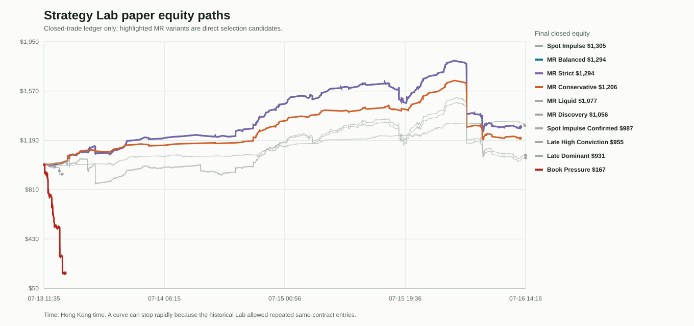
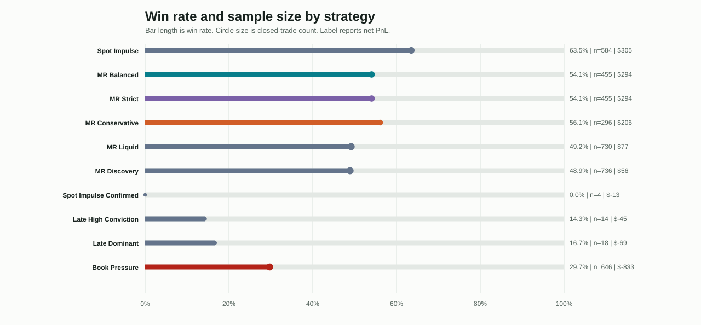
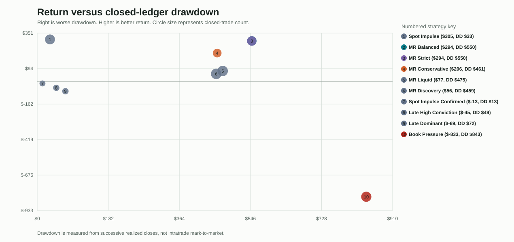
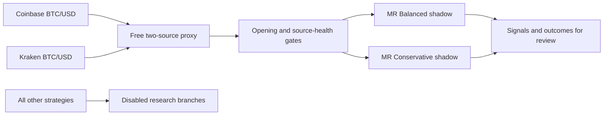

# Polybot Strategy Lab Comparative Review - 2026-07-17

## Decision

This review keeps only two Strategy Lab candidates enabled in `LAB_SHADOW_ONLY=true`:

- `MR Balanced` as the higher-throughput candidate.
- `MR Conservative` as the lower-throughput candidate with a slightly better closed-trade win rate and lower closed-ledger drawdown.

`MR Strict` is disabled because it is empirically redundant with `MR Balanced` in this sample. Every other run is disabled and left as a research branch. This is a **shadow-selection decision**, not approval to resume paper entries or any live-capital activity.

## Scope And Evidence Boundary

- Data source: read-only query of the running VPS database, `file:/app/data/polybot.db?mode=ro`.
- Closed-trade sample: 2026-07-13 11:35 to 2026-07-16 14:16 HKT.
- Closed position rows: 3,938 across ten independent paper ledgers.
- Figures and machine-readable summaries: `analysis/strategy_lab_comparative_20260717/`.
- Equity and drawdown use realized closes only. They do not include intratrade mark-to-market.

The sample predates the 2026-07-16 settlement-source incident and the execution-safety revision. It contains Binance/Chainlink reference mismatch and repeated same-contract entries. Therefore its positive PnL is useful for **relative pruning**, but is not evidence of deployable alpha.

## Executive Findings

1. **MR Strict and MR Balanced are the same strategy in this data.** Their only parameter difference is `min_edge`: Strict uses `0.020`, Balanced uses `0.015`. Yet both made exactly 455 entries over the same 194 contracts, with the same side for every entry. The $0.47 PnL difference is execution-order and fee noise, not an independent strategy effect.
2. **Balanced has the best gross MR return, while Conservative is the cleaner risk preference.** Balanced finished +$294.37 on 455 closes; Conservative finished +$206.35 on 296 closes. Conservative had higher win rate (56.1% vs 54.1%), higher profit factor (1.24 vs 1.21), lower fees, and lower closed-ledger drawdown ($461 vs $550).
3. **Neither historical MR result is safe to restore directly.** Both suffered a 42-trade longest losing streak and the July 16 cascade. Their number of entries per contract also proves the prior re-entry design was overtrading.
4. **Book Pressure should be retired from the active Lab.** It lost $833, had 29.7% win rate, 84% closed-ledger drawdown, and averaged more than 16 entries per contract.
5. **Non-MR runs remain research-only.** Spot Impulse is the apparent raw winner (+$305, 63.5% win rate, $33 closed-ledger drawdown), but it is a different signal family and shares the old mismatched settlement reference. It needs a separate, source-aligned shadow study before reactivation.

## Equity Paths

The most important feature is not the final endpoint. Around July 16, the formerly rising MR curves experience a near-vertical loss episode. This is the same reference-price and repeated-entry failure documented in the incident postmortem.

Interpretation:

- MR Balanced and MR Strict track almost exactly because they selected the same entries.
- MR Conservative rises more slowly but with fewer entries and lower fee spend.
- Book Pressure falls rapidly from the beginning; this is not a tolerable exploratory variant.
- Spot Impulse's strong curve is an observation to investigate, not a reason to mix it with the retained MR pair.

## Ten-Strategy Scorecard

| Strategy | Net PnL | Return | Closed trades | Contracts | Win rate | Profit factor | Max closed-ledger drawdown | Longest loss streak | Active decision |
| --- | ---: | ---: | ---: | ---: | ---: | ---: | ---: | ---: | --- |
| Spot Impulse | $305.43 | 30.5% | 584 | 246 | 63.5% | 1.45 | $32.69 | 6 | Research-only |
| MR Balanced | $294.37 | 29.4% | 455 | 194 | 54.1% | 1.21 | $549.80 | 42 | Keep in shadow |
| MR Strict | $293.90 | 29.4% | 455 | 194 | 54.1% | 1.21 | $549.51 | 42 | Disable as duplicate |
| MR Conservative | $206.35 | 20.6% | 296 | 140 | 56.1% | 1.24 | $461.04 | 42 | Keep in shadow |
| MR Liquid | $76.78 | 7.7% | 730 | 266 | 49.2% | 1.04 | $475.07 | 40 | Disable / research |
| MR Discovery | $55.84 | 5.6% | 736 | 266 | 48.9% | 1.03 | $458.51 | 40 | Disable / research |
| Spot Impulse Confirmed | -$13.33 | -1.3% | 4 | 4 | 0.0% | 0.00 | $13.33 | 4 | Disable / insufficient sample |
| Late High Conviction | -$44.69 | -4.5% | 14 | 3 | 14.3% | 0.14 | $48.76 | 7 | Disable |
| Late Dominant | -$69.38 | -6.9% | 18 | 6 | 16.7% | 0.15 | $72.19 | 10 | Disable |
| Book Pressure | -$833.00 | -83.3% | 646 | 40 | 29.7% | 0.25 | $842.97 | 67 | Retire from active Lab |

## Strict Versus Balanced

| Test | Result |
| --- | --- |
| Configuration difference | Only `min_edge`: Strict `0.020`; Balanced `0.015` |
| Strict entries | 455 |
| Balanced entries | 455 |
| Same contract-and-side entries | 455 |
| Strict-only entries | 0 |
| Balanced-only entries | 0 |
| Shared contracts | 194 |
| Net PnL difference | $0.47, immaterial |

The lower Balanced threshold did not actually admit any marginal trade in this sample. Keeping both would duplicate correlation, fees, dashboard attention, and future risk capacity without adding a distinct hypothesis. `MR Strict` should therefore be removed rather than treated as confirmation.

## Balanced Versus Conservative

| Metric | MR Balanced | MR Conservative | Reading |
| --- | ---: | ---: | --- |
| Net PnL | $294.37 | $206.35 | Balanced generated more gross return. |
| Closed trades | 455 | 296 | Conservative traded 35% fewer times. |
| Unique contracts | 194 | 140 | Conservative is more selective. |
| Win rate | 54.1% | 56.1% | Conservative has a modest hit-rate advantage. |
| Profit factor | 1.21 | 1.24 | Conservative has slightly cleaner realized payoff. |
| Gross fees | $289.30 | $185.24 | Conservative consumed materially less fee budget. |
| Max closed-ledger drawdown | $549.80 | $461.04 | Conservative reduced, but did not solve, tail risk. |

The pair is worth comparing in shadow because it represents a real choice: return and activity for Balanced, versus selectivity and slightly better realized quality for Conservative. The pair does **not** provide diversification against settlement-reference failure because both share the same underlying model family and old price-reference assumption.

## Re-entry Evidence

The old Lab allowed a strategy to close and reopen the same five-minute contract. Average entries per contract show why the historical result must not be extrapolated:

| Strategy | Entries | Unique contracts | Entries per contract |
| --- | ---: | ---: | ---: |
| MR Balanced | 455 | 194 | 2.35 |
| MR Conservative | 296 | 140 | 2.11 |
| MR Liquid | 730 | 266 | 2.74 |
| MR Discovery | 736 | 266 | 2.77 |
| Book Pressure | 646 | 40 | 16.15 |

This is not simply higher signal frequency. It is evidence that exit logic and re-entry policy compounded exposure inside the same settlement window. The current deployment permanently locks a contract after the first entry, so future shadow or paper outcomes are not comparable one-for-one with this old ledger.

## Exit Mix

| Strategy | Take profit | Stop loss | Time exit |
| --- | ---: | ---: | ---: |
| MR Balanced | 246 | 209 | 0 |
| MR Conservative | 166 | 130 | 0 |
| Spot Impulse | 351 | 213 | 20 |
| Book Pressure | 192 | 454 | 0 |

The MR variants' positive final PnL masks a nearly balanced TP/SL count. The July 16 failure shows that a stop-loss count alone is inadequate when a false signal can immediately reopen. The repaired contract lock is therefore a correctness control, not a parameter optimization.

## Active Configuration

The active system remains `LAB_SHADOW_ONLY=true`. It may collect decisions and signals, but cannot create a paper entry. The current accepted market conditions are:

- Coinbase and Kraken must be fresh and within the configured spread bound.
- The first 30 seconds are observation-only, and no signal is eligible before 60 seconds.
- An abnormal opening range rejects the full contract.
- Once paper mode is eventually considered, there is one entry per contract, one open portfolio position, and a daily loss halt.

## Recovery Gate

Do not turn off `LAB_SHADOW_ONLY` based on this report. The historical paper sample used the invalid settlement proxy and repeated entry path, so it cannot validate future paper execution.

The next review should require:

1. A sufficiently long free-proxy shadow sample with source-health observations and actual Polymarket outcomes recorded per signal.
2. Separate calibration of Balanced and Conservative after the new opening filter and single-entry lock; old PnL must not be mixed into the new sample.
3. A comparison of each signal against final Polymarket outcome, including source divergence and opening-shock rejection rates.
4. A fresh decision on whether either candidate has enough evidence for a small, bounded paper-only experiment.

## Reproducibility

- Generator: `analysis/strategy_lab_comparative_report.py`.
- Raw derived outputs: `analysis/strategy_lab_comparative_20260717/summary.json` and `strategy_metrics.csv`.
- The generator opens the VPS SQLite database read-only and writes only its local report artifacts.
