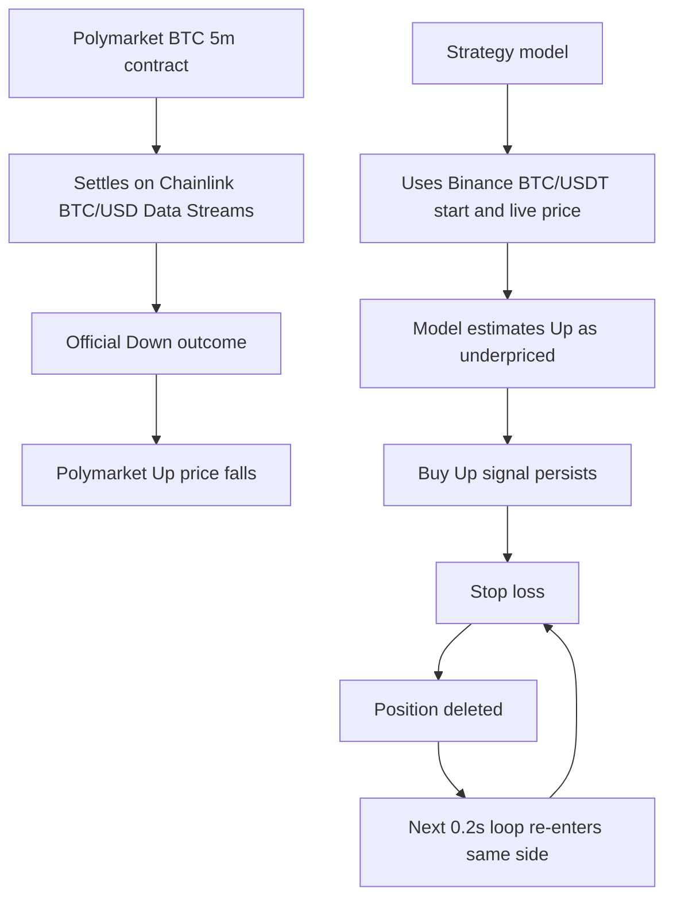

# Polybot Strategy Lab Incident Postmortem - 2026-07-16

## Incident classification

- Date: 2026-07-16 (Hong Kong time).
- System: Polybot Strategy Lab, BTC 5-minute Polymarket paper runs.
- Severity: P0 for strategy correctness and execution safety.
- Capital impact: paper ledger only. No live execution adapter, wallet, or exchange account was involved.
- Current state: only MR Balanced and MR Conservative are enabled in `LAB_SHADOW_ONLY=true`; no positions are open and no shadow signal can create a paper entry. The deployed service requires the expected Chainlink settlement-source declaration while using a clearly labelled free research proxy for shadow analysis.

The event is a strategy and execution incident, not an accounting-display bug. It demonstrates a failure mode that would be unacceptable before any live-capital deployment.

## Executive summary

MR Balanced and MR Conservative suffered large peak-to-trough paper drawdowns during the same overnight regime:

| Strategy | Peak equity | Trough equity | Maximum drawdown | Peak-to-trough window |
| --- | ---: | ---: | ---: | --- |
| MR Balanced | $1,805.08 | $1,255.29 | -$549.80 | 2026-07-16 03:13-07:45 HKT |
| MR Conservative | $1,651.62 | $1,190.58 | -$461.04 | 2026-07-16 03:13-07:45 HKT |

The dominant loss was not a one-tick chart artifact. On one five-minute contract, `btc-updown-5m-1784149500`, MR Balanced closed 56 positions for `-$398.66`; MR Conservative closed 53 positions for `-$344.80`. The system repeatedly re-entered the same side after stop losses.

The direct root cause was a settlement-reference mismatch. Polymarket explicitly resolved the contract from Chainlink BTC/USD Data Streams, while the strategy model used Binance BTC/USDT for both the start price and current price. The model therefore interpreted a market price as extreme mispricing when the market was correctly pricing the Chainlink-settled outcome.

## Confirmed evidence

### Settlement-source mismatch

For `btc-updown-5m-1784149500`, Polymarket's official event metadata specifies Chainlink BTC/USD Data Streams as the resolution source.

- Chainlink `priceToBeat`: `64,967.281932057136`.
- Chainlink final price: `64,907.76611369948`.
- Official outcome: Down.

Source: [Polymarket event metadata](https://gamma-api.polymarket.com/events?slug=btc-updown-5m-1784149500).

During the same market, the strategy used Binance BTC/USDT:

- Stored market-start reference: `64,929.58`.
- Strategy spot during the loss sequence: about `64,946.02`.
- Model probability for Up: about `68%`.
- Polymarket implied Up probability: about `5.5%-8%`.

The model treated the gap as a large positive expected edge and repeatedly bought Up. The official Chainlink reference was already below its required starting benchmark, so Down was the correct settlement outcome. This is the causal explanation for the model error; it is not evidence that Polymarket was offering a free 60-percentage-point arbitrage.

### Re-entry amplification

The loss became severe because the current Strategy Lab did not inherit the legacy engine's cooldown and per-market safety state.

- The Lab loop evaluates the same market approximately every `0.2` seconds.
- A stop loss deletes the position record.
- The next loop can immediately pass the same signal and open the same side again.
- `REENTRY_COOLDOWN_SEC=60` existed in configuration but was not used by the Lab.
- Lab documentation and code intentionally disabled automatic circuit breakers.

At 05:05-05:08 HKT, the two strategies traded the same contract repeatedly. Their model edge became larger as the market probability moved against their incorrect Binance-based reference, which increased rather than suppressed re-entry.

The 07:30-07:33 HKT contract `btc-updown-5m-1784158200` produced a second, shorter cascade:

| Strategy | Closed positions | Net PnL |
| --- | ---: | ---: |
| MR Balanced | 21 | -$106.56 |
| MR Conservative | 16 | -$87.67 |

## Root-cause tree



The settlement-reference mismatch is the primary correctness failure. Re-entry without a cooldown, per-market lock, or circuit breaker is the amplification failure. Fixing only one of them is insufficient for live-capital readiness.

## Immediate containment completed

The following actions were applied to the Hong Kong VPS on 2026-07-16:

1. Paused all ten Strategy Lab runs.
2. Confirmed zero enabled runs and zero open positions after the pause.
3. Added a settlement-source guard. A BTC 5-minute run now requires Polymarket to declare the expected Chainlink BTC/USD resolution source.
4. Made the guard fail closed. Until the application actually retrieves and decodes an authenticated Chainlink Data Streams report, it refuses all new Lab entries rather than falling back to Binance.
5. Rebuilt the `polybot` container and verified the health endpoint.

This is a containment measure, not completion of Chainlink integration. It prevents an accidental resume from restoring the faulty Binance-based execution path.

## 2026-07-16 free-proxy safety revision

The paid Data Streams API is not economically suitable for this paper research phase. The Lab therefore moves to a clearly labelled, free research proxy: the median of public Coinbase BTC/USD and Kraken BTC/USD quotes. This proxy is not presented as the settlement reference and must not be used to claim oracle-arbitrage edge.

The following controls apply before any future paper entry:

- Both USD sources must be fresh within ten seconds and agree within five basis points.
- The first 30 seconds are observed only; no entry is allowed before 60 seconds.
- If the proxy range in the opening observation window exceeds 20 basis points, the full five-minute contract is locked.
- The entire Strategy Lab may enter a contract only once. Closing a position never reopens eligibility.
- The Lab permits one open position at a time and pauses all runs at a HKT-day realized loss of 10 USD.
- Deployment begins in `LAB_SHADOW_ONLY=true`; it records signals without creating paper trades until a shadow calibration review is complete.

## Required repair

### 1. Use the settlement source as the model source

Implement an authenticated Chainlink Data Streams client that:

1. Retrieves the exact BTC/USD stream used by the Polymarket market.
2. Stores the signed report used at the market start as the `price_to_beat` reference.
3. Uses a current signed report from the same stream for the live price.
4. Rejects a market when the resolution source, stream identifier, report timestamp, report schema, or report freshness cannot be verified.
5. Persists report identifiers and observation timestamps beside each decision for audit and replay.

The Data Streams client requires an API key, API secret, and the full BTC/USD stream ID. A generic Chainlink price feed or Binance quote is not an acceptable substitute for a market that names Data Streams as its resolution source.

### 2. Restore execution safety independently of alpha

After the source is aligned, add these controls before resuming any run:

- Stop-loss lock: after a stop loss, the same `strategy_run_id + slug` cannot re-enter before contract expiry.
- Cooldown: enforce `REENTRY_COOLDOWN_SEC` in Strategy Lab, not only in the legacy engine.
- Per-market entry budget: cap each strategy's entries for one contract, including profitable exits.
- Strategy circuit breaker: pause a run after a configured consecutive-loss or drawdown budget.
- Portfolio correlation cap: bound total exposure across parameter variants trading the same contract and side.
- Requote and liquidity gate: prohibit an entry if the executable price changes beyond a configured bound between signal evaluation and fill.

### 3. Handle take-profit continuation explicitly

A take-profit exit followed by an immediate same-side re-entry is economically a hold decision plus avoidable fees. Once source alignment and stop-loss locks are in place, use this state policy:

```text
take profit reached + same-side signal remains valid -> hold or trail
take profit reached + signal invalid/reversed -> close
stop loss reached -> close and lock this strategy/contract
```

This policy must not be used to defer a stop loss or to override the settlement-source guard.

## Recovery acceptance criteria

No strategy may be resumed until all of the following are true:

- Chainlink Data Streams credentials are configured on the VPS without exposing them in source control.
- A smoke test reads and decodes the configured BTC/USD stream successfully.
- The stored start reference and current reference come from the same Chainlink stream.
- A historical replay of `btc-updown-5m-1784149500` identifies Down rather than generating a persistent Up-buy signal.
- Unit tests cover source mismatch rejection, missing/stale report rejection, stop-loss contract lock, cooldown enforcement, and entry-cap enforcement.
- A fresh paper run completes without a same-contract stop-loss re-entry.
- The dashboard exposes the active settlement source, report observation time, and source-health status for each active market.

## Lessons

1. A probability model is only meaningful relative to the exact settlement variable. Similar BTC prices from different providers are not interchangeable in a five-minute binary contract.
2. Large apparent model edge is a source-health alarm until source equivalence has been proven, not permission to increase trading frequency.
3. Parameter variants are correlated portfolio exposure when they share a signal, market snapshot, contract, and execution source.
4. A paper system is valuable precisely because it can expose this failure before a live execution adapter exists. This event blocks any transition to real capital until the acceptance criteria are met.
