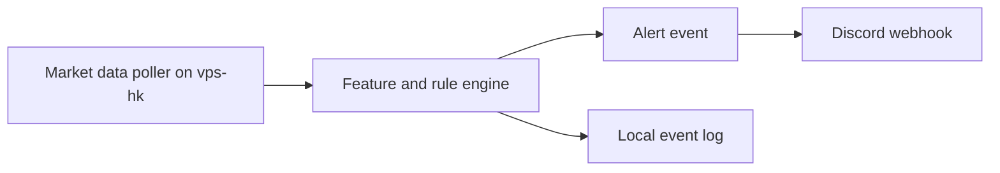
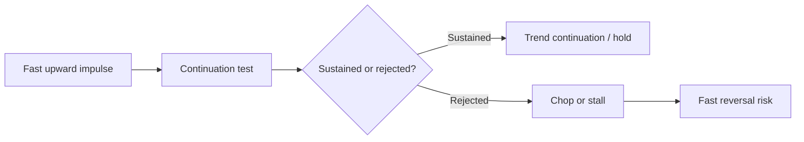
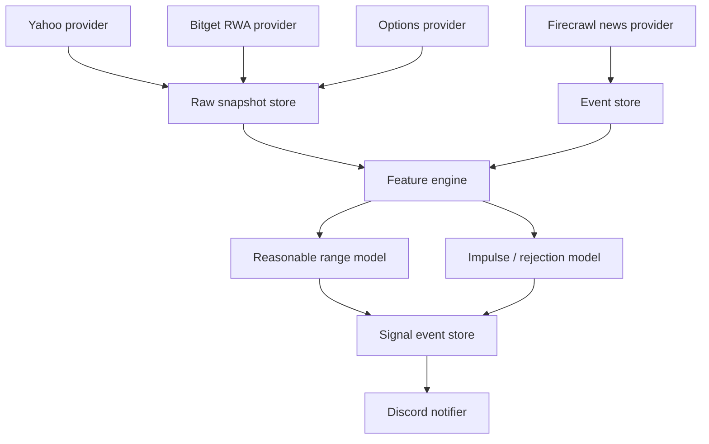

# Market Data and Intraday Risk Signal Notes

Last updated: 2026-07-13 HKT

This note suspends alert wording and notification-content design. The current priority is to define what data the system should collect, what can realistically be obtained from the existing VPS setup, and how to turn the user's intraday market observations into measurable signals.

## 1. Current Verified Infrastructure

The project currently has three useful live pieces:

- `tradingview-lite-backend.service` on `vps-hk`
  - Runs the Go/Fiber backend.
  - Listens on `127.0.0.1:8088`.
  - Polls the watchlist and sends Discord webhook tests successfully.
  - Current storage mode is memory unless `DATABASE_URL` is set, so durable daily collection still needs Postgres.
- `yahoo-finance-mcp` on `vps-hk`
  - Runs on port `3011`.
  - Provides Yahoo Finance MCP access with bearer-token protection.
  - Useful for quotes, charts, and basic market data.
- `bitget-wallet-mcp.service` on `vps-hk`
  - Runs on `127.0.0.1:8871/mcp`.
  - Active and authenticated with bearer token.
  - Verified MCP server info: `Bitget Wallet`, version `1.28.1`.
  - Exposes RWA stock tools including `rwa_ticker_list`, `rwa_stock_info`, `rwa_order_price`, `rwa_kline`, and `rwa_my_holdings`.

The VPS also has Firecrawl-related services running, including a compatible adapter and news worker. These should be treated as an event/news ingestion layer, not as price truth.

### Implemented v0 Backend Endpoints

As of 2026-07-11, the backend exposes the first RWA proxy endpoints:

- `GET /api/v1/rwa/:symbol/info`
  - Calls Bitget Wallet MCP `rwa_stock_info`.
  - Returns latest RWA price, market/session status, tradable sessions, and a warning that RWA depth is not Nasdaq/NYSE Level 2.
- `GET /api/v1/rwa/:symbol/kline?period=1m&size=60`
  - Calls Bitget Wallet MCP `rwa_kline`.
  - Returns recent RWA K-line candles and exposes whether the source reports nonzero volume.
- `GET /api/v1/rwa/:symbol/summary`
  - Combines RWA stock info and recent K-line in one response.

This is intentionally kept separate from `/api/v1/quote/:symbol` so the system does not mix official-equity-like Yahoo quotes with tokenized-stock/RWA proxy prices.

The backend also exposes the first free options prototype through Yahoo Finance MCP:

- `GET /api/v1/options/:symbol/chain?near=20`
  - Calls Yahoo Finance MCP `options`.
  - Returns the nearest-expiration option chain around the ATM strike.
  - Includes bid, ask, mid, last, volume, open interest, raw Yahoo IV, and last trade timestamps.
- `GET /api/v1/options/:symbol/expected-move`
  - Returns an ATM straddle-implied expected move summary.
  - Uses call mid plus put mid, with last-price fallback when bid/ask are incomplete.

This is a free exploration layer. It should not be treated as OPRA-backed production options data.

Live VPS verification:

- `vps-hk` backend `/health` reports `options_enabled=true`.
- `GET /api/v1/options/NVDA/expected-move` returns nearest-expiration ATM straddle data.
- `GET /api/v1/options/NVDA/chain?near=6` returns six calls and six puts around ATM, while preserving raw contract counts.

The backend also exposes a first intraday feature endpoint:

- `GET /api/v1/features/:symbol/intraday`
  - Combines Yahoo quote, Yahoo `1m` bars, Yahoo options, and Bitget/Ondo RWA when available.
  - Re-solves option IV from bid/ask midpoint using Black-Scholes bisection.
  - Computes realized volatility from `1m` log returns.
  - Computes price speed over `1m`, `3m`, `5m`, and `15m`.
  - Computes RWA proxy speed over the same horizons when RWA K-line exists.
  - Computes reasonable ranges from previous close, regular open, and current price.

Live VPS verification for `NVDA`:

- ATM strike: `210`
- Average raw Yahoo IV: about `0.2505`
- Average resolved IV from bid/ask midpoint: about `0.3458`
- One-trading-day expected move from resolved IV: about `2.18%`
- Realized move from current `1m` bars: about `2.36%`
- Projected daily realized move: about `2.02%`
- Selected range source: `options_resolved_iv`

### Durable Collection Deployment (2026-07-13)

The VPS now runs TradingView-Lite against an isolated `Postgres 16` container. It is bound only to `127.0.0.1:5433` and does not reuse the Onyx database. The backend applies embedded Goose migrations at startup; the deployed database is currently at migration version `2`.

Persisted records now include:

- append-only Yahoo quote samples with provider time, receipt time, data age, session, and warning;
- finalized Yahoo `1m` bars and separately persisted Bitget/Ondo RWA `1m` bars;
- append-only Bitget/Ondo RWA price samples, provider market state, and source labels;
- selected near-ATM Yahoo option contracts, bid/ask/mid/last, IV input source, model-resolved IV, and expected-move summaries;
- derived intraday feature snapshots, including source/freshness metadata and reasonable-range selection;
- daily market summaries, collection-run health, and table-size diagnostics.

Current conservative runtime budgets and cadences are:

| Provider path | Baseline | Fast lane | Shared request budget |
|---|---:|---:|---:|
| Yahoo chart, full watchlist | `60s` | five focus symbols at `30s` | `50/min` |
| Bitget/Ondo RWA, explicit mapped symbols | `30s` | `NVDA` at `15s` | `40/min` |
| Yahoo options, six liquid symbols | `5m` | none | `20/min` |
| Derived features | `60s` | none | local computation |

Collector errors and `429` responses trigger exponential backoff. Focus jobs wait for their first interval, so they do not duplicate the initial baseline request burst.

New read/diagnostic endpoints:

- `GET /api/v1/snapshots/quotes`
- `GET /api/v1/snapshots/rwa` and `/api/v1/snapshots/rwa/bars`
- `GET /api/v1/snapshots/options/contracts` and `/api/v1/snapshots/options/iv`
- `GET /api/v1/snapshots/features`
- `GET /api/v1/daily/:symbol?date=YYYY-MM-DD`
- `GET /api/v1/collection/runs` and `/api/v1/collection/storage`

The Sunday verification intentionally showed stale Yahoo equity and options timestamps. In this state, the feature engine records the historical values but emits `selectedSource: unavailable` and does not construct a current reasonable range from stale inputs. This is the intended boundary: stale Yahoo data is preserved for audit, not treated as live risk information.

## 2. Data Sources We Can Use

### Yahoo Finance

Use for MVP US equity and ETF monitoring:

- Watchlist quote snapshots.
- `1m` bars during regular and extended sessions when available.
- Basic chart metadata: provider timestamp, market state, current price, previous close.
- Option chain exploration is possible in some Yahoo clients, but it is not robust enough to be the final source for real-time IV.

Limitations:

- No formal SLA.
- API behavior can change.
- Minute-level history is limited.
- Some symbols or sessions may be delayed or missing.
- It is not a true Level 2 order book source.

### Bitget Wallet RWA

Use as a secondary, night-session-aware proxy for tokenized US equity exposure:

- RWA stock list, for example `NVDAon`.
- Stock info: latest RWA price, `market_status`, `market_status_code`, session list, trading limits.
- `tradable_sessions` can include `premarket`, `regular`, `postmarket`, `overnight`, and `offhours`.
- `rwa_kline` gives minute K-line for tokenized stock prices.

Important verified observation:

- `NVDAon` returns RWA price and sessions.
- `rwa_kline` returns `1m` candles.
- The returned RWA K-line currently has `hasVolume=false`; fields such as volume, amount, tx count, buy/sell volume can be zero.
- `rwa_stock_info` exposes `order_book_depths`, but the current MCP tools do not give us a clean full exchange-style limit order book for US equities.

Interpretation:

- Bitget RWA is useful as a night/overnight price proxy and cross-market signal.
- It should not be treated as the same thing as Nasdaq official trades or NBBO.
- Its price may reflect tokenized/RWA liquidity, RFQ/AMM routing, and provider-specific market making.

### Firecrawl / News

Use for event explanation:

- Company news.
- Earnings headlines.
- Analyst rating changes.
- SEC filings and company press releases.
- Macro or sector news.

The news layer should produce structured evidence, not directly trigger trading action by itself.

Suggested event fields:

```json
{
  "symbol": "NVDA",
  "source": "firecrawl_news",
  "headline": "...",
  "url": "...",
  "published_at": "...",
  "received_at": "...",
  "event_type": "earnings|guidance|analyst|macro|sector|filing|unknown",
  "confidence": 0.0,
  "summary": "..."
}
```

### Options Data

Options are central for estimating market-implied risk, but Yahoo is not enough for production-grade IV.

Current implemented free prototype:

- Yahoo Finance MCP can fetch option chains.
- The backend computes a nearest-expiration ATM straddle expected move.
- Raw Yahoo `impliedVolatility` is returned but marked advisory.
- The backend re-solves IV from bid/ask midpoint using Black-Scholes bisection.
- The expected-move calculation is useful for approximate risk-range calibration, not direction prediction.

Minimum useful option data:

- Expiration chain.
- Strike, call/put.
- Bid, ask, mid, last.
- Volume and open interest.
- Implied volatility if provided, or enough inputs to compute IV.
- Underlying spot price timestamp.
- Quote timestamp and delay status.

For robust real-time IV, use a vendor with OPRA-backed options quotes, such as Polygon/Massive, Tradier, ORATS, Cboe LiveVol, ThetaData, or Interactive Brokers. The first implementation can start with delayed or sampled options, but the system must label delay and avoid acting as if it is real-time.

## 3. Can We Automatically Remind the User?

Yes. This is already feasible.

Current confirmed path:



However, the quality of reminders depends on data quality. The reminder engine should not be expanded until the data layer records freshness, provider, session, and confidence.

Minimum event safety fields:

- `symbol`
- `provider`
- `provider_time`
- `received_time`
- `data_age_seconds`
- `session`
- `signal_type`
- `confidence`
- `reason_codes`
- `blocked_reason`

## 4. Daily Collection Plan

The system should collect a daily watchlist package for each symbol.

### Price Data

For each watchlist symbol:

- Yahoo quote every 10-60 seconds.
- Yahoo `1m` bars.
- Bitget RWA quote/K-line when a matching RWA ticker exists.
- Session labels:
  - `overnight`
  - `premarket`
  - `regular`
  - `postmarket`
  - `offhours`
- Open, previous close, premarket high/low, first 5 minutes before regular open.

### News Data

For each watchlist symbol:

- News headlines from Firecrawl-backed sources.
- Company official IR page when available.
- SEC/filing events.
- Sector ETF news and macro event tags.

### Options Data

For each liquid symbol:

- Near-term expiries.
- At-the-money and near-the-money option quotes.
- IV estimate from mid price.
- IV percentile or IV rank if enough history exists.
- Skew proxy: put IV minus call IV around comparable deltas.

### Persistence

The VPS backend currently runs in memory mode. For daily collection, Postgres should become mandatory.

Suggested tables:

- `quote_snapshots`
- `rwa_snapshots`
- `minute_bars`
- `news_events`
- `option_quotes`
- `iv_snapshots`
- `intraday_features`
- `signal_events`

## 5. Ten-Second Monitoring Feasibility

Ten-second monitoring is feasible for lightweight snapshots, but not every data source should be polled at that speed.

Suggested cadence:

| Data | Cadence | Notes |
|---|---:|---|
| Yahoo quote | 10-30s | Watch rate limits and stale timestamps |
| Yahoo 1m bars | 60s | Bars are naturally minute-based |
| Bitget RWA stock info | 10-30s | Good for night/overnight proxy |
| Bitget RWA 1m K-line | 60s | K-line is minute-level |
| News | 1-5m | More often only for event windows |
| Options chain | 30-120s | Depends on paid provider and rate limits |
| Derived features | 10s | Can recompute from cached snapshots |

For a 20-50 symbol watchlist, 10-second Yahoo polling may be too aggressive if done naively. The safer architecture is a scheduler with provider-specific rate budgets and adaptive backoff.

### Sub-Minute Feasibility Probe

Live test on `vps-hk` at 2026-07-11 HKT:

- Yahoo chart `interval=15s` and `interval=30s` both failed with Yahoo's own error. Valid chart intervals start at `1m`.
- Yahoo `1m` and `2m` chart intervals worked for `NVDA`.
- Yahoo quote endpoints can be polled every 15 seconds, but the provider timestamp only advances when Yahoo has new quote data. During the test window the US market was closed, so `NVDA`, `AMD`, `QQQ`, `RKLB`, and `IONQ` returned stable provider timestamps.
- Bitget/Ondo RWA `stock_info` can be polled every 15 seconds. `NVDAon` and `TSLAon` showed price movement over 15-second samples, while some tickers such as `AMDon` were `marketStatus=close`.
- Bitget/Ondo RWA K-line `period=15s` and `period=30s` failed for current `*on` tickers; `period=1m` worked.
- Current mapped RWA tickers are `dataSource=ondo`. Bitget docs say second-level RWA K-line periods (`1s`, `5s`, `15s`) are xStocks-only; Ondo does not support second-level periods.

Practical conclusion:

- For free US equity Yahoo data, treat `1m` as the minimum true bar granularity.
- For sub-minute monitoring, store quote snapshots at 15-30 second cadence, but treat them as sampled quotes, not 15-second OHLCV bars.
- For RWA proxy, 15-second polling can be useful on open `ondo` tickers, but K-line history remains 1m unless we add xStocks mappings or a WebSocket provider.

## 6. Limit Order Book Reality

This requires separating three different things:

1. Official US equity book:
   - Nasdaq/NYSE/ARCA Level 2 or total-view depth.
   - Requires licensed market-data vendor.
   - Yahoo does not provide this.
2. NBBO / quote:
   - Best bid and ask.
   - Much easier than full book.
   - Still usually needs a real market data provider for real-time.
3. Bitget RWA book or liquidity:
   - Tokenized stock liquidity, not the same as Nasdaq book.
   - Can still be useful as a proxy for overnight pressure and RWA liquidity.

For this system, start with quote-level imbalance proxies rather than full book imbalance:

- RWA premium/discount versus Yahoo last/previous close.
- Bid/ask spread if provider gives it.
- RWA price speed and pullback behavior.
- Volume or transaction imbalance only where the source actually provides nonzero buy/sell data.

## 7. User's Core Signal Hypothesis

The user observes that intraday price action often has a characteristic acceleration/deceleration pattern:

- When a stock is being pulled up aggressively, price rises quickly over a short interval.
- If the move is not supported, it may stop rising, oscillate, or move sideways briefly.
- After that failed continuation, it may drop quickly.
- This transition could be useful for take-profit, stop-loss, entry, or exit decisions.

This is not just a chart pattern. It is a microstructure-like regime transition:



The signal should measure:

- Magnitude: how much price moved.
- Time: how quickly the move happened.
- Continuation: whether price keeps making new highs/lows.
- Support: whether volume, market/sector, RWA, and options IV support the move.
- Exhaustion: whether velocity decays while spread/volatility stays elevated.
- Reversal: whether price breaks the short-term impulse base or VWAP/anchored VWAP.

## 8. Candidate Features

### Price Speed

Measure returns over several horizons:

- 10 seconds
- 30 seconds
- 1 minute
- 3 minutes
- 5 minutes

For each horizon:

- return
- velocity = return / elapsed seconds
- acceleration = current velocity minus previous velocity
- max adverse excursion after impulse
- time since local high/low

Implemented v0:

- Yahoo bar-based speed over `1m`, `3m`, `5m`, and `15m`.
- RWA K-line based proxy speed over the same horizons when a mapped RWA ticker exists.
- True 15-second price speed requires persisted quote snapshots; current free Yahoo/RWA setup can be polled at 15-30 seconds, but the durable feature endpoint currently uses `1m` bars/K-lines.

### Reasonable Range

Estimate whether current move is inside or outside the reasonable range.

Inputs:

- Previous close.
- Regular open.
- Premarket high/low.
- First 5 minutes before regular open.
- ATR and realized volatility from recent days.
- Intraday realized volatility from the current session.
- Options-implied move when IV data exists.
- Sector ETF movement.
- Market index movement.
- RWA overnight movement.

Output:

- `normal`
- `elevated`
- `abnormal_without_explanation`
- `abnormal_but_explained`
- `blocked_due_to_missing_data`

Implemented v0 range mechanics:

- Previous-close range: previous close plus/minus selected one-day move.
- Regular-open range: regular open plus/minus selected one-day move.
- Current remaining range: current price plus/minus selected one-day move scaled by remaining regular-session minutes. This is only computed during regular US trading hours.
- Selected one-day move is currently `max(option-derived one-day move from resolved IV, projected daily realized move from 1m returns)`.

Agent/news interpretation is still a separate layer: Firecrawl/news and market-regime reasoning should explain whether the quantitative range is likely too narrow or too wide on an event day.

### RWA Overnight Pressure

For symbols with RWA equivalents:

- RWA overnight return.
- RWA high/low during offhours.
- RWA premium/discount versus official previous close.
- RWA momentum into US premarket.
- RWA reversal after US open.

This is especially useful for names like NVDA, TSLA, AAPL and other liquid tokenized stocks.

### Options IV

Use IV to avoid mistaking priced-in risk for surprise:

- ATM IV level.
- IV change versus previous day.
- Expected move for the day or week.
- IV percentile/rank.
- Put-call skew.
- Option volume/open interest concentration.

If price move is large but IV did not move, it may be a flow/liquidity move. If IV spikes with price drop, market is repricing risk.

### Imbalance

For US equities, full order-book imbalance may not be available in v1. Use staged proxies:

Stage 1:

- Up/down volume proxy from bars.
- Close location value inside minute bar.
- RWA premium/discount.
- Relative performance versus sector.
- Price speed asymmetry.

Stage 2:

- Bid/ask quote imbalance if a real-time provider supplies quotes.
- Spread expansion.
- Quote update frequency.

Stage 3:

- Real Level 2 depth imbalance from a licensed provider.

## 9. First Useful Signal: Impulse Rejection

This is a good first signal to implement because it maps directly to the user's observation.

Definition:

- Detect a fast impulse:
  - price rises by at least `x%` or `x * recent_sigma` within `t` seconds.
- Detect failure:
  - no new high after `n` seconds,
  - velocity falls below a threshold,
  - price crosses below short-term anchored VWAP or impulse midpoint,
  - sector/RWA does not confirm,
  - volume does not expand or fades quickly.
- Output:
  - `WATCH`: impulse is forming.
  - `ALERT`: impulse is rejected and reversal risk is high.
  - `BLOCKED`: data stale or market/news context missing.

This should be evaluated first as a descriptive signal, not a trading command.

## 10. Architecture Change Needed

The current backend can poll and alert, but this idea needs a provider-aware data bus.



Immediate engineering implication:

- Do not put all logic inside alert rules.
- First build normalized provider snapshots.
- Then compute features.
- Then generate signals.
- Then route signals to Discord.

## 11. Short-Term Implementation Plan

### Step 1: Durable collection

- Enable Postgres for `tradingview-lite-backend` on VPS.
- Store quote snapshots and bars.
- Add provider/source fields everywhere.

### Step 2: Bitget RWA provider

- Add a provider adapter calling `127.0.0.1:8871/mcp`.
- Map watchlist symbols to RWA tickers, for example `NVDA -> NVDAon`.
- Store RWA stock info and RWA K-line snapshots.

### Step 3: News ingestion

- Add Firecrawl news fetcher.
- Store headline, source URL, timestamps, extracted summary, event type.

### Step 4: Options IV prototype

- Choose a real options data source.
- Store option chain snapshots.
- Compute ATM IV and expected move.

### Step 5: Feature engine

- Price speed.
- Intraday range z-score.
- Relative sector move.
- RWA overnight pressure.
- Impulse rejection.

### Step 6: Alerts

- Only after the above data is stored and inspectable should we refine alert content.

## 12. Current Answer to the User's Questions

### What data are we using for analysis?

Currently:

- Yahoo chart/quote data.
- Watchlist polling.
- Stored bars and quotes in backend memory mode.
- Discord for notification delivery.

Next:

- Bitget RWA stock data for tokenized night/overnight proxy.
- Firecrawl news for event explanation.
- A paid or broker-grade options provider for real IV.
- Postgres for durable historical feature computation.

### Can `vps-hk` access Bitget data?

Yes. `bitget-wallet-mcp.service` is running on `vps-hk` and exposes authenticated MCP over `127.0.0.1:8871/mcp`. Verified RWA tools include stock info and K-line.

### Can we do automatic reminders?

Yes. Discord webhook reminders already work. The next problem is not notification delivery; it is making the signals reliable enough to deserve notification.

### Can we get 10-second watchlist prices?

Probably yes for quote snapshots, but provider-specific limits must be respected. Yahoo should not be hammered blindly. Bitget RWA stock info can be sampled as a separate proxy. Bars remain naturally minute-level unless a real tick/quote provider is added.

### Can we get real-time limit order book?

Not from Yahoo. Not cleanly from the current Bitget RWA MCP as a Nasdaq-equivalent book. For official US equity Level 2, use a licensed market data vendor. For v1, use quote/price-speed/volume/RWA proxies.

### Can we get options information and compute real-time IV?

Not robustly from the current stack. We should add an OPRA-backed options data provider or broker API. Yahoo can be exploratory but should not be the production IV source.

### Can we measure reasonable price range and imbalance?

Yes. Start with a hybrid model:

- Historical realized volatility and ATR.
- Current session realized volatility.
- Premarket and first-5-minute range.
- RWA overnight movement.
- Sector/index relative move.
- Options expected move when IV exists.
- Speed/acceleration and impulse rejection.

The first high-value signal should be impulse rejection rather than a generic RSI/MACD alert.

## 13. External References Checked

- Bitget Wallet MCP Server: https://github.com/bitget-wallet-ai-lab/bitget-wallet-mcp
  - Confirms RWA stock tools such as ticker list, stock info, order price, K-line, config, and holdings.
- Bitget Wallet RWA page: https://web3.bitget.com/rwa
  - Confirms Bitget Wallet's RWA/tokenized asset positioning.
- Massive options API overview: https://massive.com/docs/rest/options/overview
  - Options snapshot data includes contract pricing, implied volatility, quotes, trades, Greeks, and open interest.
- Tradier options chain and quote docs:
  - https://docs.tradier.com/reference/brokerage-api-markets-get-options-chains
  - https://docs.tradier.com/docs/quotes
  - Tradier includes Greeks and volatility fields via ORATS, including bid/mid/ask IV.
