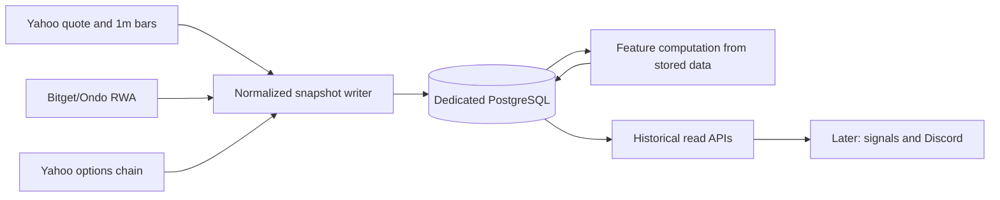

# Next Goal: Durable Market Data Collection Foundation

Status: implementation complete; final verification recorded on 2026-07-13 HKT

This document turns the current TradingView-Lite prototype into the next bounded implementation goal. It deliberately pauses alert wording, LLM/news interpretation, and automated trading. The deliverable is a trustworthy historical record from which those later layers can be built and audited.

## Why This Is Next

The live backend on `vps-hk` is healthy, with Yahoo, Bitget RWA, options, and Discord configured. Its `/health` endpoint currently reports `store: memory`, however. A restart therefore loses quote history, and the current intraday feature endpoint recomputes from remote sources rather than from an inspectable local record.

Without durable snapshots, the system cannot honestly answer questions such as:

- Was a 15-second move fast relative to its own observed intraday history?
- Did the price move occur before or after an option-IV change?
- What did the final five pre-open minutes look like?
- Was an alert based on fresh regular-market data, an overnight RWA proxy, or an old Yahoo sample?

The next phase solves that evidence problem first.

## Goal

Build and deploy a provider-aware, durable collection layer for the current watchlist on `vps-hk`.

It must use an isolated PostgreSQL database and persist:

1. Yahoo equity/ETF quote observations and finalized `1m` bars.
2. Bitget/Ondo RWA quote observations and finalized `1m` RWA bars where mappings exist.
3. Selected near-ATM Yahoo option-contract data, the model-resolved IV inputs/results, and expected-move outputs.
4. Derived intraday feature snapshots, including realized volatility, price speed, range bands, source choice, and warnings.
5. Collection-run health, provider errors, rate-limit/backoff state, and data freshness information.

The service must expose read APIs for this history and prove that data survives a backend restart.

## Scope Boundary

### In scope

- A dedicated Postgres 16 instance for TradingView-Lite, isolated from the existing Onyx/Postgres deployment.
- Versioned Goose migrations. The service must no longer rely on ad-hoc `CREATE TABLE` calls as the only schema lifecycle.
- Provider-normalized append-only snapshots, with explicit `provider_time`, `received_at`, `data_age_seconds`, source/session labels, and warnings.
- Provider-budgeted schedulers with configurable symbol sets and backoff.
- Retention and storage accounting.
- Query endpoints and an end-to-end VPS verification run.

### Explicitly out of scope

- Discord alert content, alert-rule expansion, notification cadence, or any automated trade execution.
- A claim of official real-time Nasdaq/NYSE data, OPRA options data, or US-equity Level 2 order book data.
- Yahoo `15s` or `30s` OHLCV bars. They do not exist in the tested provider path.
- Firecrawl/news ingestion and LLM-generated explanations. They become the next separate phase after price/option history is available.
- A paid market-data migration. Providers remain replaceable behind interfaces.

## Collection Design

The key rule is that every later feature or signal must be attributable to stored observations. The service must never silently combine a Yahoo quote with an RWA price as though they were the same market.

## Sampling Policy

The cadence is intentionally two-tiered. Free Yahoo data is useful for an MVP but should not be hit indiscriminately at 10 seconds for every symbol.

| Data | Baseline cadence | Fast lane | Stored purpose | Boundary |
|---|---:|---:|---|---|
| Yahoo quote | 60s for all watchlist symbols during available sessions | 15-30s for a configurable focus list of at most five symbols | sampled price speed and freshness | sampled quotes, not sub-minute OHLCV or tick data |
| Yahoo `1m` bars | 60s | none | finalized regular and extended-session bars | Yahoo's true minimum tested bar granularity is `1m` |
| Bitget RWA quote | 30s for mapped symbols outside or alongside US sessions | 15s for configurable mapped focus symbols | overnight/off-hours context | Ondo/RWA proxy, not Nasdaq/NYSE truth |
| Bitget RWA `1m` K-line | 60s | none | RWA bar history and proxy speed | current tested Ondo mappings do not provide `15s`/`30s` K-lines |
| Yahoo options | 5m for a configurable liquid-options subset | none initially | near-ATM IV, straddle, and range history | free/unofficial data; timestamps and quote completeness remain visible |
| Derived features | 60s for the full watchlist | 15-30s for the focus list, using cached/latest option snapshots | price-speed and range history | no feature is produced from stale/missing mandatory inputs without warnings |

All cadences must be environment-configurable. Each provider gets a concurrency limit, a request budget, exponential backoff after failure or `429`, and a health metric. A provider timestamp that does not advance is recorded as stale; it is never treated as a new trade.

## Data Model

Use normalized fields for queries and compact JSONB only for provider-specific details. Do not persist a large raw response on every poll.

| Table | Grain | Required fields |
|---|---|---|
| `market_quote_snapshots` | one Yahoo observation | symbol, provider, price, provider_time, received_at, data_age_seconds, session, market_state, warning |
| `rwa_quote_snapshots` | one Bitget/Ondo observation | symbol, rwa_ticker, provider, data_source, price, provider_time when supplied, received_at, provider_market_status, session, warning |
| `ohlcv_bars` | one finalized bar | symbol, provider, timeframe, timestamp, OHLCV, received_at, session |
| `option_contract_snapshots` | one contract at one collection time | symbol, expiration, strike, right, bid, ask, mid, last, volume, open_interest, contract/provider timestamps, received_at, raw-IV advisory value, resolved-IV, IV input price/source |
| `iv_snapshots` | one selected near-ATM result | symbol, expiration, ATM strike, call/put IV, average IV, straddle move, one-day move, risk-free-rate assumption, dividend-yield assumption, received_at, quality warnings |
| `intraday_feature_snapshots` | one computed feature state | symbol, computed_at, input freshness, realized-volatility fields, price-speed fields, RWA fields, range bands, selected source, warnings |
| `collection_runs` | one provider/scheduler run | collector, provider, started_at, finished_at, symbols attempted/succeeded, records written, rate-limit/backoff state, error summary |
| `daily_market_summaries` | one symbol/date state | previous close, premarket high/low, final pre-open five-minute state, regular open, daily high/low, selected daily move and source |

`latest_quotes` may remain as a fast read model, but it is not a substitute for `market_quote_snapshots`.

### Time and session semantics

- Every persisted record keeps source time separate from local receipt time.
- US equity session labels are derived in `America/New_York`: `premarket`, `regular`, `postmarket`, and `offhours`.
- RWA provider-market status is retained separately. A RWA price is never used as the official regular-market close/open.
- The pre-open five-minute state is computed only from observations within 09:25-09:30 New York time; missing observations stay missing rather than being fabricated.
- An option IV snapshot records the exact contract price used. Bid/ask midpoint is preferred; last/bid/ask fallback remains explicitly labeled.

## Range and price-speed contracts

The existing range engine stays probabilistic and direction-neutral. It stores its inputs and selected source, rather than only its final bands.

The option-derived one-day move remains:

\[
\text{one-day move}=S\sigma_{\mathrm{IV}}\sqrt{1/252}
\]

where \(S\) is the underlying spot used for that option snapshot and \(\sigma\) is the annualized IV resolved from that contract's quoted price. A near-expiry ATM straddle remains a separate, directly observed expected-move estimate and is not silently conflated with the square-root-time estimate.

For the first version, price speed is a sampled-quote feature:

\[
v_{\Delta t}=\frac{100(P_t/P_{t-\Delta t}-1)}{\Delta t}
\]

where \(\Delta t\) is the actual elapsed receipt/provider time, not the requested scheduler cadence. This prevents a delayed or skipped poll from masquerading as a 15-second move.

## Retention and disk budget

The first retention policy balances research value with the user's concern about VPS disk use:

| Data | Retention | Reason |
|---|---:|---|
| Raw sampled Yahoo and RWA quote snapshots | 14 days | enough for short-horizon speed/rejection research without retaining unbounded high-frequency samples |
| Options and IV snapshots | 90 days | supports IV/range comparisons across several event cycles |
| Intraday feature snapshots and collection runs | 90 days | supports signal diagnostics and provider-quality audits |
| Finalized `1m` bars and daily summaries | retained | small enough for the watchlist and valuable for longer baselines |

A nightly retention task must report rows removed and table sizes. It must have a dry-run mode in tests. Storage size must be visible through health/diagnostic output before it becomes an operational issue.

## API and configuration deliverables

Add time-bounded, provider-aware read endpoints. Exact route names can follow existing Fiber conventions, but the API must support:

- Quote/RWA snapshots by symbol, provider, and time range.
- Option contracts and IV snapshots by symbol and expiry/time range.
- Feature snapshots by symbol and time range.
- A structured daily summary by symbol and New York trading date.
- Collector health, recent run results, and retention/storage diagnostics.

Add configuration for the all-symbol cadence, focus-symbol list, RWA mapping/focus list, liquid-options subset, provider concurrency/budgets, and retention periods. Sensible defaults must keep the current full watchlist safe under free-provider limits.

## Implementation Sequence

1. Add migrations, repository models, and tests for append-only snapshots, time-range queries, and retention.
2. Provision a dedicated Postgres container and private persistent volume on `vps-hk`; do not reuse Onyx's database.
3. Replace the single monolithic poller with provider-aware collection jobs while retaining the existing `1m` bar behavior.
4. Persist selected option contracts/IV and derived feature snapshots from cached normalized data.
5. Add historical read and diagnostics APIs.
6. Deploy, run migrations, let the scheduler collect real samples, restart the backend, and verify persistence and session/freshness fields on `vps-hk`.
7. Record actual provider behavior and any backoff/rate-limit observations in the project notes.

## Acceptance Criteria

- `/health` on `vps-hk` reports `store: postgres`.
- A running scheduler creates Yahoo quote snapshots, finalized `1m` bars, and feature snapshots for at least one liquid watchlist symbol; it also records RWA and options snapshots when those providers are configured and available.
- All persisted observations contain provider identity, source/receipt time semantics, session classification, and an explicit freshness/warning state.
- A time-range query returns historical points in chronological order and does not collapse a sampled quote series into only the latest value.
- A backend restart does not remove earlier observations; the service resumes collection without duplicate finalized-bar corruption.
- Option snapshots preserve the contract values actually used for the Black-Scholes solve, including IV-input source and model assumptions.
- Retention has unit/integration coverage and a verified VPS diagnostic path.
- Provider failure or stale data produces a recorded collection-health result, not fabricated zero values and not a Discord alert.
- Existing quote, bar, RWA, options, feature, and Discord test endpoints remain functional.

## Definition of Done

This goal is complete when the VPS has collected and retained real data across at least one market-session transition or equivalent configured collection window, and the history is queryable after a service restart. It does not require waiting weeks for a research-quality baseline; that observation period starts only after the collector is deployed.

## After This Goal

The next decision should be based on stored evidence:

1. Add Firecrawl/official-news ingestion with source provenance and event classification.
2. Implement one signal only: impulse rejection, using sampled-quote speed, failed continuation, range utilization, session context, and optional RWA confirmation.
3. Observe the signal without notifications first, then decide its Discord threshold and cooldown.

Do not add generic technical alerts or LLM trade recommendations before this data foundation has produced inspectable history.
