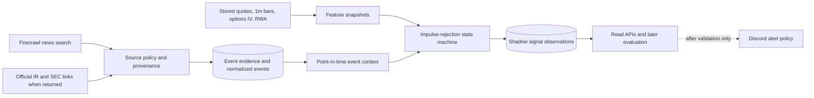
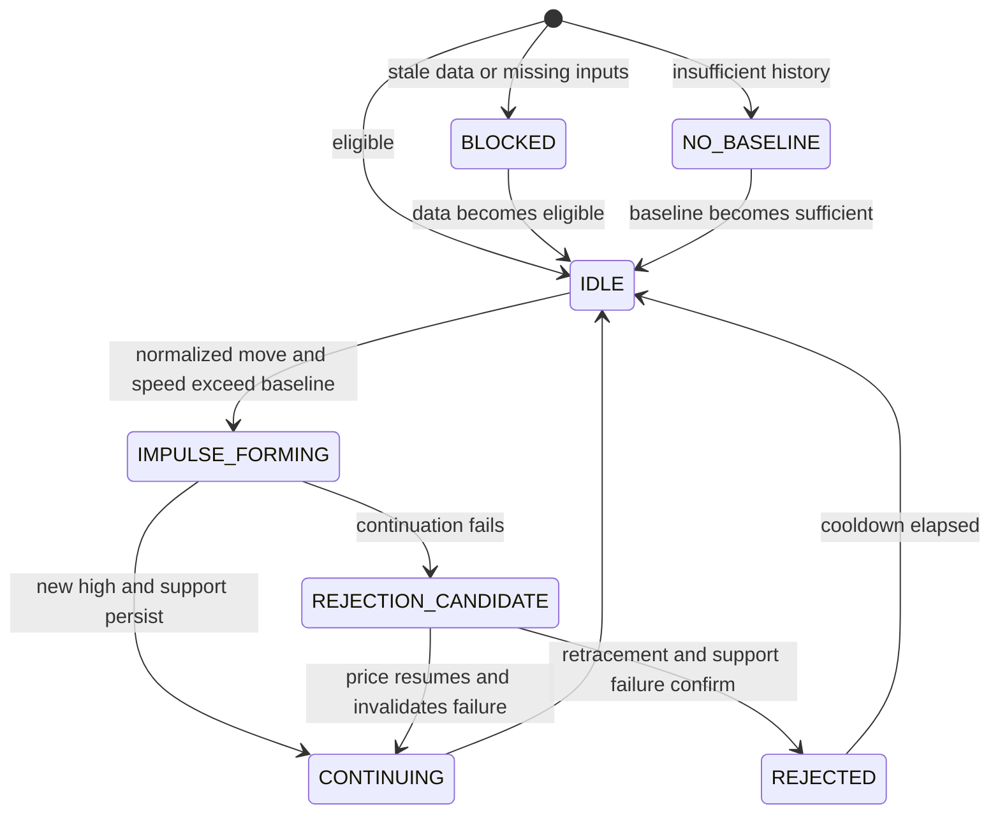

# Next Goal: Event Evidence and Shadow Signal Layer

Status: implementation complete and verified on `vps-hk`, 2026-07-13 HKT

## Decision

The durable market-data foundation is deployed on `vps-hk`. The next goal is not a generic AI trading agent and not an immediate Discord alert engine. It is an evidence-backed market-context layer that:

1. collects and preserves market, company, sector, and macro evidence with source provenance;
2. joins that evidence to the existing quote, `1m` bar, RWA, options-IV, and range snapshots;
3. writes inspectable, non-notifying shadow decisions for one signal family: intraday impulse rejection.

This directly serves the intended workflow: automatic monitoring and decision support for a US-equity/ETF watchlist, without automatic order placement or unsupported directional claims.

## Why This Is the Right Next Boundary

The collector now answers what happened to price, volatility, and a tokenized overnight proxy. It cannot yet distinguish among:

- an issuer-specific event;
- a sector or index move;
- a macro-risk event;
- a move with no verified explanatory evidence; and
- a stale or degraded provider response.

An alert that skips this layer would look precise while being difficult to audit. The immediate engineering problem is therefore evidence quality and context, not more technical indicators or an LLM-generated buy/sell recommendation.

## Goal

Build and deploy an event-evidence, market-context, and shadow-signal layer for the current TradingView-Lite backend on `vps-hk`.

For every focus symbol, it must be possible to retrieve:

- the raw event evidence that was available at a given point in time;
- the source, provider, source-quality tier, publication time, discovery time, ticker-match policy, and ingest result;
- a structured market context that keeps observations separate from inference; and
- a recorded impulse-rejection decision state with its exact feature inputs, eligibility checks, and reasons.

The only user-facing notification permitted during this goal is a system-health failure. Normal market, risk, and signal notifications remain suspended.

## Scope

### In scope

- A Firecrawl news-ingestion adapter using the existing VPS-compatible JSON-RPC service, configured by environment variables and never by a hard-coded secret.
- A source-policy layer that classifies evidence by source tier and tracks the actual provider route and query policy.
- Structured persistence for raw event evidence, normalized events, ingestion runs, point-in-time event contexts, and shadow-signal observations.
- Symbol-, group-, and macro-scoped queries.
- Strict ticker filtering for single-symbol queries; explicit non-strict handling for sector and macro queries.
- Canonical-URL and normalized-headline deduplication.
- Backoff, health, provider errors, empty-result state, and coverage accounting.
- One descriptive intraday signal: `IMPULSE_REJECTION`.
- Time-bounded read APIs and diagnostics for evidence, context, shadow decisions, and ingestion health.
- Unit, integration, and live VPS verification with real persisted data.

### Explicitly out of scope

- Automated order placement, broker integration, or position sizing.
- A directional model, a claim of predictive alpha, or LLM-generated buy/sell commands.
- Discord delivery of normal alerts, daily briefs, or action candidates.
- Social-media ingestion and sentiment trading.
- A claim of real-time licensed news, official US-equity NBBO, US Level 2, or OPRA options data.
- Treating Bitget/Ondo RWA price or liquidity as US-equity exchange truth.
- A large technical-indicator or multi-signal alert catalog.

## Information Architecture



The system keeps four concepts separate:

| Concept | Meaning | Must not be confused with |
|---|---|---|
| Evidence | A retrieved, attributable item such as a filing, IR release, or news report | A conclusion that it caused the move |
| Event | A normalized, deduplicated candidate explanation connected to one or more evidence items | A source article or a price signal |
| Context | The point-in-time collection of market state and evidence available to a symbol | A trading command |
| Shadow signal | A deterministic, inspectable decision state recorded for later evaluation | A Discord alert or an order |

## Evidence Policy

### Source tiers

| Tier | Examples | Allowed use |
|---|---|---|
| `T1_OFFICIAL` | issuer IR, SEC/EDGAR filing, exchange or government release | May support a company or macro event when time and symbol match |
| `T2_PRIMARY` | central-bank, government statistical release, recognized ETF/index provider | May support a macro or sector event |
| `T3_REPORTING` | reputable reporting returned by the news provider | Context only unless corroborated or explicitly attributed to a primary source |
| `T4_UNVERIFIED` | unknown origin, stale metadata, weak ticker match, or provider warning | Stored for audit; never promotes an action state |

A single `T3_REPORTING` item must never be labeled as the confirmed cause of a symbol's move. It can produce `unconfirmed` context, not a directional recommendation.

### Query policy and cadence

Free news sources must be budgeted. The system must not query every watchlist symbol every minute.

| Query lane | Candidates | Cadence | Purpose |
|---|---|---:|---|
| Market/macro | `SPY`, `QQQ`, volatility and scheduled macro terms | 5 minutes during relevant sessions | broad risk context |
| Group context | semiconductor, space, clean energy, quantum groups | 10 minutes | peer and sector explanation |
| Baseline symbol | current watchlist symbols | 10-15 minutes | maintain current evidence coverage |
| Triggered symbol | symbol with fresh price/range anomaly | 1-2 minutes, bounded window | investigate an observed move |
| Official-source follow-up | candidates with high impact | on demand, strict allowlist | corroborate an event |

Every run records the requested symbols, `strictTicker`, provider route, provider counts, returned count, and errors. `429`, stale cache, empty result, and source-provider degradation are distinct states.

## Persisted Model

Use Goose migrations and the existing Store pattern. Preserve short metadata and links, not full copyrighted article bodies.

| Table | Grain | Required fields |
|---|---|---|
| `event_ingestion_runs` | one source query/run | provider, query, requested scope, strict-ticker flag, provider route, start/end, result/error counters, backoff state |
| `event_evidence` | one retrieved source item | canonical URL, headline hash, title, short snippet, source domain, provider, publisher, source tier, published/discovered/received times, matched symbols, event type, metadata/warnings |
| `market_events` | one normalized event candidate | scope, primary symbol or group, event type, first/last seen, evidence status, severity, lifecycle state |
| `market_event_evidence` | event-to-evidence relation | event id, evidence id, relation type, classification confidence, created time |
| `event_context_snapshots` | one symbol at one decision time | as-of time, market-data freshness, evidence coverage, known event ids, reason codes, risk state, structured inference and warnings |
| `shadow_signal_observations` | one evaluation state | signal type, symbol, as-of time, state, eligibility, feature/evidence/context references, reasons, threshold version, observation outcome fields |

Important time fields are:

- `published_at`: time claimed by the source;
- `discovered_at`: time exposed by Firecrawl/provider;
- `received_at`: time TradingView-Lite received the item;
- `as_of`: the point in time at which a context or signal was evaluated.

No context may use evidence whose `received_at` is later than its `as_of`. This prevents accidental look-ahead bias during later evaluation.

## Context Contract

The initial context endpoint returns data, evidence, and bounded inference. It does not return a generic natural-language trade recommendation.

```json
{
  "symbol": "NVDA",
  "asOf": "2026-07-13T14:35:00Z",
  "marketData": {
    "fresh": true,
    "quoteAgeSeconds": 12,
    "session": "regular",
    "rangeUtilization": 0.71,
    "relativeMove": {"benchmark": "SMH", "valuePct": -1.8}
  },
  "eventCoverage": {
    "state": "partial",
    "lastSuccessfulIngestionAt": "2026-07-13T14:34:10Z",
    "tiers": {"T1_OFFICIAL": 0, "T3_REPORTING": 2},
    "warnings": ["no_primary_source_confirmation"]
  },
  "observations": ["price_move_exceeds_peer_move"],
  "inference": {
    "riskState": "elevated",
    "reasonCodes": ["relative_underperformance", "unconfirmed_event_context"],
    "confidence": "limited"
  }
}
```

`riskState` can be `normal`, `elevated`, or `blocked`. `blocked` is mandatory when freshness, minimum inputs, or evidence policy makes a higher-confidence interpretation unsafe.

## Shadow Signal: Impulse Rejection

This is a market-structure observation, not a prediction of the next candle. It operationalizes the user's observation that a rapid lift can lose support, pause, and reverse when continuation fails.

### Data eligibility

The state machine must return `BLOCKED` or `NO_BASELINE`, rather than a false positive, when any mandatory condition fails:

- the selected Yahoo quote samples are stale or their actual elapsed time is unknown;
- fewer than five regular sessions of sampled quote/`1m` history are available for a symbol baseline;
- the signal runs outside the intended US session without explicitly switching to the RWA-proxy regime;
- an RWA field is mistakenly used as an official equity price; or
- required feature inputs are missing.

### State machine



The first implementation records, at minimum:

- actual elapsed time between samples;
- impulse return, normalized speed, and acceleration;
- local high/low, retracement, and time without a new high;
- remaining expected daily range and range utilization;
- short-term `1m` volume and VWAP/impulse-midpoint relation where valid;
- benchmark/group relative move;
- current option-IV/range freshness and optional RWA proxy condition;
- event-context coverage and event-risk state; and
- a versioned threshold configuration plus reason codes.

The velocity feature must use observed elapsed time, not the intended polling period:

\[
v_{\Delta t}=\frac{100\left(P_t/P_{t-\Delta t}-1\right)}{\Delta t}
\]

Here (P_t) is the selected provider quote and (Delta t) is the actual positive duration between valid samples. A delayed poll cannot masquerade as a 15-second impulse.

No numerical threshold is fixed in code until stored samples establish symbol- and session-specific empirical quantiles. The initial threshold set is versioned configuration, not a claim of universal trading validity.

## Interfaces and Configuration

The exact Fiber route names should follow existing conventions. The implementation must provide equivalent read endpoints for:

- `GET /api/v1/events?symbol=&from=&to=`;
- `GET /api/v1/event-context/:symbol?as_of=`;
- `GET /api/v1/shadow-signals?symbol=&from=&to=`;
- `GET /api/v1/event-ingestion/runs`;
- `GET /api/v1/event-ingestion/storage`.

Required configuration includes:

- Firecrawl JSON-RPC endpoint and authentication material through environment variables;
- enable flag and provider request budget;
- focus symbols, group/benchmark mapping, and macro queries;
- per-lane polling cadence and triggered-query cooldown;
- official-domain allowlist and source-tier policy;
- retention for event evidence, contexts, and shadow observations;
- signal threshold version and shadow-only mode, defaulting to enabled;
- `DISCORD_*` remain unused for normal event/signal output in this goal.

Secrets are never committed, logged, returned by diagnostics, or included in collection-run error messages.

## Implementation Sequence

1. Confirm the VPS Firecrawl endpoint's JSON-RPC contract with a real ticker query, without exposing credentials; add an adapter health probe and failure classification.
2. Add migrations, Store methods, models, and tests for evidence, normalized events, contexts, ingestion runs, and shadow observations.
3. Implement Firecrawl ingestion with strict symbol policy, canonical deduplication, source-tier classification, rate budget, and backoff.
4. Add group/macro queries and deterministic context assembly from point-in-time stored evidence plus existing market/feature snapshots.
5. Implement the impulse-rejection state machine in shadow-only mode with explicit `BLOCKED` and `NO_BASELINE` states.
6. Add historical read/diagnostic APIs and retention accounting.
7. Deploy to `vps-hk`, collect a bounded live sample, restart the service, and verify persistence, freshness, provenance, and absence of normal Discord posts.
8. Review false-positive and blocked-rate diagnostics before proposing any notification thresholds.

## Acceptance Criteria

- A live Firecrawl ticker query succeeds through the configured VPS path, and its `providerRoute`, `strictTicker`, and timing metadata are persisted.
- A provider-specific failure, empty result, or `429` is visible as a run outcome and does not appear as a valid absence of news.
- Same URL or materially identical headline is not stored repeatedly; separately sourced corroboration is retained as separate evidence relations.
- A non-strict sector/macro result cannot be silently promoted into a company-specific event.
- Every event context can return raw evidence identifiers and no future-received evidence is used in an historical `as_of` view.
- `IMPULSE_REJECTION` writes `IDLE`, `IMPULSE_FORMING`, `REJECTED`, `BLOCKED`, and `NO_BASELINE` observations as appropriate, with exact feature and threshold provenance.
- Stale Yahoo data, missing options, and unavailable RWA data produce warnings or `BLOCKED`, never fabricated zero values or a false confirmation.
- The backend survives a restart with evidence, context, and shadow observations intact.
- No normal Discord notification is produced by this pipeline.
- Unit/integration tests cover source policy, look-ahead exclusion, deduplication, data eligibility, and state transitions; VPS verification records one real ingestion and query path.

## Definition of Done

The goal is complete when the live VPS has persisted evidence and shadow-signal observations for at least the focus watchlist during a bounded collection window, the resulting context is queryable and attributable, and the system can report why a signal was suppressed as well as why it was observed.

The observation period continues after implementation. Discord alert thresholds are a separate decision, made only after reviewing stored shadow outcomes over multiple market sessions.

## Implementation Evidence

The backend implementation adds Goose migration `003_event_evidence_shadow.sql`, Firecrawl HTTP ingestion, source-tier policy, point-in-time contexts, and the shadow-only impulse-rejection evaluator. Its configuration template is [`backend/.env.example`](./backend/.env.example), and the reproducible VPS installer is [`deploy/vps-hk/install-event-evidence.sh`](./deploy/vps-hk/install-event-evidence.sh).

The VPS verification completed on 2026-07-13 HKT:

- `/health` reported `store: postgres`, `event_evidence_enabled: true`, and a separate `firecrawl_news` budget.
- A strict `NVDA` query persisted source/provider/ticker/time metadata and returned a `T3_REPORTING` context item without promoting it to a confirmed cause.
- Symbol, macro, and four group query runs completed. Macro/group runs persisted `strictTicker: false` and their own scopes.
- The event context for `NVDA` correctly became `blocked` because its weekend Yahoo quote was stale, while the evidence remained queryable.
- Shadow observations persisted `BLOCKED` with `market_context_blocked` and a context ID; no normal Discord notification path was added.
- Restarting `tradingview-lite-backend.service` preserved evidence, normalized events, contexts, and shadow-observation counts.

Current source boundary: the free Firecrawl layer can return official IR/SEC/government links and classifies them as `T1_OFFICIAL`/`T2_PRIMARY`; it does not guarantee that an official item is available for every event. A dedicated SEC/IR feed is a later provider upgrade, not an excuse to elevate `T3_REPORTING` into an action signal.

## Follow-on Decision Gate

Only after the goal is complete should the next phase decide whether to enable notifications. The decision must use observed precision/noise, freshness failures, coverage gaps, duplicate frequency, and cooldown behavior. The candidate next goal is then a narrow alert-policy layer, not a broader trade-execution system.
