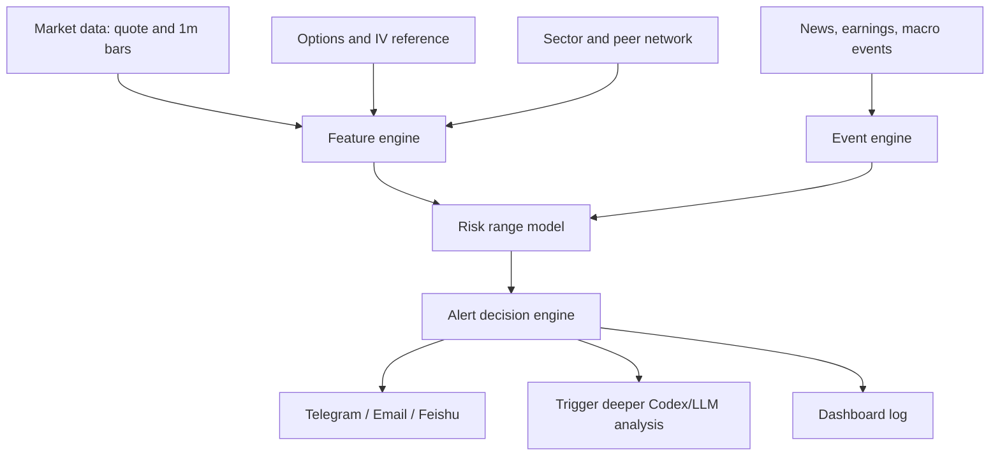

# Risk-Aware Market Monitoring Agent

Last updated: 2026-07-08 HKT

## 1. Core Positioning

This project is not just an automatic K-line alert tool. The target system is a risk-aware financial agent that monitors US equities and ETFs, explains abnormal moves, and sends structured alerts without placing trades automatically.

The system should continuously answer:

- What is the normal intraday range for this symbol today?
- Are price, volume, volatility, news, sector movement, or options pricing abnormal?
- Is the move driven by company news, macro risk, sector beta, options market repricing, sentiment, or liquidity?
- Should the user observe, reduce risk, add to watchlist, wait for confirmation, or simply log the event?
- Does the system reduce screen-watching and FOMO instead of creating more noise?

The first production boundary is:

- Market universe: mostly US stocks and ETFs.
- Options: used as risk-pricing reference, not necessarily traded directly in v1.
- Time scale: intraday 1m monitoring first, with 5m/15m/hourly/daily aggregation later.
- Execution: alert-only, no automatic order placement.
- Notification: Telegram first; email/Feishu can be added for summaries.

## 2. Latency Semantics

Do not confuse API response speed with market-data freshness.

The backend must track three separate notions of latency:

- Network latency: time between request and response.
- Market timestamp latency: how old the quote/bar is relative to provider or exchange timestamp.
- Authorization delay: whether the data vendor provides real-time or delayed data for the specific symbol/market.

Every market-data record should carry:

```json
{
  "provider": "yahoo_chart",
  "provider_time": "2026-07-07T15:14:01Z",
  "received_time": "2026-07-07T15:14:05Z",
  "data_age_seconds": 4,
  "symbol": "AAPL",
  "interval": "1m"
}
```

Alert logic must reject or downgrade stale data. API latency alone is not enough to prove real-time behavior.

## 3. System Layers



### Layer 1: Market Monitoring

This is the TradingView-like base layer:

- Near-real-time quote.
- 1m/5m/15m/hourly/daily bars.
- Price alert.
- Technical alert.
- Volume spike alert.
- Gap up/down alert.
- Premarket and after-hours alert.
- Watchlist groups.
- Multi-symbol context symbols such as SPY, QQQ, SMH, XLE, TLT, and VIX.

Goal: do not miss explicit levels, moves, or technical conditions the user cares about.

### Layer 2: Risk Explanation

This layer explains why a move matters:

- Is the whole market moving, or only this stock?
- Is the sector moving with it?
- Did the company release news, earnings, filings, guidance, legal/regulatory updates, or analyst changes?
- Is the move large relative to recent realized volatility or ATR?
- Is volume confirming the move?
- Is options IV rising, falling, or already pricing the risk?
- Are there macro events today, such as CPI, FOMC, jobs data, or Fed speakers?

The output should be trader-style risk explanation, not blind prediction.

### Layer 3: Opportunity Discovery

The system should monitor cross-sectional relationships:

- Leader versus laggards.
- Sector ETF versus individual stock.
- High-beta theme basket versus market index.
- Stocks that follow downside but fail to recover on upside.
- Overreaction candidates versus structurally weak names.

Important example groups:

- Memory/semiconductors: MU, NVDA, AMD, SMH.
- Space: RKLB, SPCX, ARKX, UFO, LUNR.
- Clean/energy: TE, FCEL, XLE, TAN, ICLN.
- Quantum: IONQ, RGTI, QBTS, QUBT.
- Market context: SPY, QQQ, IWM, TLT, VIX.

The goal is not only to alert on a single ticker, but to understand the relation network around that ticker.

### Layer 4: Decision Assistance

The system should not auto-trade in v1. It should produce graded alerts:

| Level | Meaning | Delivery |
|---|---|---|
| INFO | Record only; no interruption | Dashboard |
| WATCH | Worth monitoring | Telegram digest |
| ALERT | Key level or abnormal move | Telegram |
| URGENT | Position-related major risk | Telegram + email |
| ANALYSIS_TRIGGER | Ask Codex/LLM for deeper explanation | Full analysis note |
| BLOCKED | Data stale or cause unclear | No action recommendation |

The agent should reduce cognitive load. It should not generate constant noise.

## 4. Agent Decomposition

### Market Data Agent

Responsibilities:

- Pull quote and chart data.
- Store finalized OHLCV bars.
- Keep intrabar quote points separate from finalized bars.
- Track `provider_time`, `received_time`, and `data_age_seconds`.
- Detect stale data, missing bars, null current bars, and provider rate limits.
- Compute first-level technical features.

### Risk Analyst Agent

Responsibilities:

- Estimate daily/intraday risk range.
- Compare stock movement against market and sector proxies.
- Monitor realized volatility, ATR, volume z-score, and relative underperformance.
- Integrate news, earnings, macro calendar, and options IV when available.
- Produce structured risk explanations.

### Decision Assistant Agent

Responsibilities:

- Map risk signals to alert levels.
- Respect user watchlist, positions, and risk preferences.
- Generate concise action candidates.
- Avoid automatic trading.
- Mark decisions as blocked when data is stale or explanation is underdetermined.

## 5. MVP Watchlist

First version can use:

```yaml
core:
  semis_memory: [MU, NVDA, AMD, SMH]
  space: [RKLB, SPCX, ARKX, UFO, LUNR]
  energy_clean: [TE, FCEL, XLE, TAN, ICLN]
  quantum: [IONQ, RGTI, QBTS, QUBT]
  market_context: [SPY, QQQ, IWM, TLT, "^VIX"]
```

Previously tested with Yahoo 1m monitoring:

- MU: quote and 1m chart available.
- RKLB: quote and 1m chart available.
- TE: quote and 1m chart available.
- FCEL: quote and 1m chart available.
- IONQ, RGTI, QBTS, QUBT: quote and 1m chart available.
- SPCX, ARKX: quote and 1m chart available.

The local backend smoke test also confirmed AAPL, NVDA, and TSLA quote freshness with data ages around 0-4 seconds during regular market hours.

## 6. Alert Rule Protocol

The first rule protocol should support price, intraday move, relative performance, volume, and analysis triggers.

Example:

```json
{
  "symbol": "MU",
  "group": "semis_memory",
  "rules": [
    {
      "type": "price_level",
      "operator": "below",
      "value": 90
    },
    {
      "type": "intraday_move",
      "threshold_pct": 5
    },
    {
      "type": "relative_underperformance",
      "benchmark": "SMH",
      "threshold_pct": 3
    },
    {
      "type": "volume_spike",
      "window": "1m",
      "zscore": 3
    }
  ],
  "notify": ["telegram"],
  "analysis_on_trigger": true
}
```

The rule engine should support:

- Simple price conditions.
- Intraday percentage move.
- Gap up/down.
- Volume spike.
- Relative underperformance versus benchmark.
- Peer divergence within a group.
- Technical indicators such as RSI, MACD, VWAP, moving averages.
- Event-triggered analysis when news or abnormal movement appears.

## 7. Data Source Strategy

### Yahoo Finance for MVP

Yahoo can be used for MVP monitoring:

- It returns near-real-time chart metadata for many US symbols during regular market hours.
- It supports 1m bars, but the 1m historical window is limited.
- It may return incomplete/null current bars, so the backend must filter them.
- It has no institutional SLA and may rate limit or change behavior.

The backend should use Yahoo as a provider behind an interface, not as a hard-coded permanent dependency.

### Future Data Sources

Potential upgrades:

- Alpaca Market Data: stronger API path for US equities, useful if brokerage integration is later needed.
- Polygon: richer real-time WebSocket and aggregate data, better for production monitoring.
- Finnhub: useful for trades, quote, news, and some event data.
- Paid options data vendor: needed for robust IV, skew, and options-flow analysis.

No automatic trading should be enabled until data quality and alert quality have been observed for several weeks.

## 8. Current Local Backend Status

Current local backend:

- Path: `tradingview-lite/backend/`
- Local URL: `http://127.0.0.1:8088`
- Provider: Yahoo chart API.
- Endpoints:
  - `GET /health`
  - `GET /api/v1/quote/:symbol`
  - `GET /api/v1/bars?symbol=AAPL&range=1d&interval=1m`

Implemented behavior:

- Quote endpoint returns current price, provider timestamp, received timestamp, data age, last finalized bar, and last intrabar point.
- Bars endpoint returns only finalized OHLCV bars.
- Null/incomplete Yahoo current rows are dropped from K-line output.
- 60-day 1m requests correctly return a provider-limit error.

Observed backend test results:

- AAPL/NVDA/TSLA quote data age: about 0-4 seconds during live test.
- AAPL quote short polling showed changing prices.
- AAPL 1d 1m bars returned complete intraday bars.
- AAPL 5d 1m bars returned about 1658 bars.
- 1m range beyond Yahoo limit returned an explicit error.

## 9. MVP Build Plan

### Phase 1: Reliable Market Data

- Keep the current Go/Fiber backend.
- Add Postgres storage for finalized bars.
- Add provider table or metadata fields.
- Add data freshness checks.
- Add polling scheduler for watchlist symbols.
- Add local retention rules.

### Phase 2: Alert Engine

- Add alert rule schema.
- Implement price alert.
- Implement intraday move alert.
- Implement volume spike alert.
- Implement relative underperformance alert versus benchmark.
- Add Telegram notification.
- Store alert events.

### Phase 3: Risk Brief

- Add daily and intraday risk range.
- Add sector/peer comparison.
- Add news/event fetcher.
- Add basic options IV reference if provider is available.
- Generate premarket, midday, and post-close summaries.

### Phase 4: Dashboard

- Add React + lightweight-charts UI.
- Show watchlist.
- Show quote freshness.
- Show 1m bars.
- Show triggered alerts and explanations.
- Add saved layouts later.

## 10. Safety Rules

- Do not auto-trade in v1.
- Do not trigger alerts from stale data.
- Do not treat Yahoo network response time as market-data freshness.
- Do not use incomplete current bars as finalized K-line data.
- Do not produce action suggestions when news/explanation is missing.
- Prefer `BLOCKED` over confident but unsupported advice.
- Always log why an alert fired.

## 11. Open Questions

Only two decisions are still needed for the first implementation pass:

1. Should the first watchlist use the proposed groups exactly, or should any tickers be added/removed?
2. Should the first alert configuration be conservative, with fewer but higher-confidence alerts, or exploratory, with more alerts to observe system behavior?
