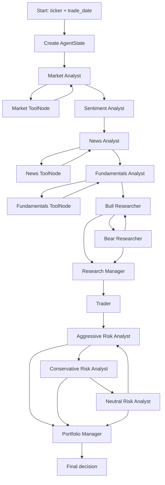
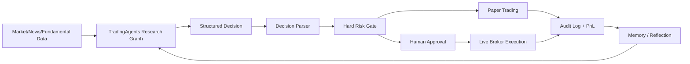

# TradingAgents 项目代码分析

分析日期：2026-06-06

本地位置：`/Users/yitwah/Projects/TradingAgents`

GitHub：https://github.com/TauricResearch/TradingAgents

## 一句话结论

TradingAgents 是一个基于 LangGraph 的多 agent 金融研究与交易建议框架。它不是 broker 执行系统，也不是可直接托管真钱的自动交易 bot；它的核心价值是把一次交易判断拆成“数据分析员 -> 牛熊研究辩论 -> 交易员计划 -> 风控辩论 -> 组合经理最终决定”的可追踪工作流。

## 项目已经下载

我已将仓库克隆到：

```text
/Users/yitwah/Projects/TradingAgents
```

项目版本来自 `pyproject.toml`：

```text
tradingagents 0.2.5
Python >= 3.10
```

主要依赖：

- `langgraph`：编排 agent state graph。
- `langchain-*`：接不同 LLM provider 和工具调用。
- `yfinance`：默认行情、基本面、新闻数据来源之一。
- `stockstats`：技术指标计算。
- `rich`、`typer`、`questionary`：CLI 交互界面。
- `backtrader`：量化/回测生态依赖，但主流程不是直接靠它执行交易。

## 顶层结构

```text
TradingAgents/
├── README.md
├── pyproject.toml
├── main.py
├── cli/
│   ├── main.py
│   ├── models.py
│   ├── stats_handler.py
│   └── utils.py
├── tradingagents/
│   ├── default_config.py
│   ├── graph/
│   ├── agents/
│   ├── dataflows/
│   └── llm_clients/
├── tests/
├── Dockerfile
└── docker-compose.yml
```

最重要的目录：

- `tradingagents/graph/`：LangGraph 工作流编排。
- `tradingagents/agents/`：各个 agent 节点，包括分析员、研究员、风控、交易员、组合经理。
- `tradingagents/dataflows/`：行情、新闻、基本面、技术指标的数据供应商路由。
- `tradingagents/llm_clients/`：不同 LLM provider 的客户端工厂。
- `cli/`：命令行交互界面。

## 如何运行

安装：

```bash
cd /Users/yitwah/Projects/TradingAgents
python -m venv .venv
source .venv/bin/activate
pip install .
```

设置 API key。默认 provider 是 OpenAI：

```bash
export OPENAI_API_KEY=...
```

运行 CLI：

```bash
tradingagents
```

或者直接跑示例脚本：

```bash
python main.py
```

`main.py` 的核心只有几行：

```python
from tradingagents.graph.trading_graph import TradingAgentsGraph
from tradingagents.default_config import DEFAULT_CONFIG

config = DEFAULT_CONFIG.copy()
ta = TradingAgentsGraph(debug=True, config=config)
_, decision = ta.propagate("NVDA", "2024-05-10")
print(decision)
```

## 核心执行流程

主入口是：

```text
tradingagents/graph/trading_graph.py
TradingAgentsGraph.propagate(company_name, trade_date, asset_type="stock")
```

执行链路：



实际条件跳转由 `tradingagents/graph/conditional_logic.py` 控制：

- 分析员节点如果最后一条 LLM message 有 `tool_calls`，就进入对应 `ToolNode`。
- 工具返回后回到同一个分析员。
- 如果没有 `tool_calls`，说明该分析员报告完成，清理 messages，进入下一个阶段。
- 牛熊辩论最多 `2 * max_debate_rounds` 轮。
- 风险辩论最多 `3 * max_risk_discuss_rounds` 轮。

默认配置中：

```python
max_debate_rounds = 1
max_risk_discuss_rounds = 1
```

也就是说默认是：

- 牛、熊各发言一次。
- 激进、保守、中性风险分析员各发言一次。

## AgentState 保存什么

状态定义在：

```text
tradingagents/agents/utils/agent_states.py
```

关键字段：

- `company_of_interest`：ticker，例如 `NVDA`。
- `asset_type`：`stock` 或 `crypto`。
- `instrument_context`：用 yfinance 解析出来的真实标的身份，防止 agent 把 ticker 讲成别的公司。
- `trade_date`：分析日期。
- `market_report`：市场/技术分析报告。
- `sentiment_report`：情绪报告。
- `news_report`：新闻/宏观报告。
- `fundamentals_report`：基本面报告。
- `investment_debate_state`：牛熊辩论历史和研究经理结论。
- `investment_plan`：Research Manager 输出。
- `trader_investment_plan`：Trader 输出。
- `risk_debate_state`：三类风险分析员辩论历史。
- `final_trade_decision`：Portfolio Manager 最终输出。
- `past_context`：历史交易记忆注入。

最后 `TradingAgentsGraph._log_state()` 会把完整状态写到：

```text
~/.tradingagents/logs/<ticker>/TradingAgentsStrategy_logs/full_states_log_<date>.json
```

## 各 agent 做什么

### Market Analyst

文件：

```text
tradingagents/agents/analysts/market_analyst.py
```

作用：

- 获取价格数据。
- 选择最多 8 个技术指标。
- 调用技术指标工具。
- 在最终报告前调用 `get_verified_market_snapshot`，用它作为 OHLCV、价格、指标数值的事实来源。

可用工具：

- `get_stock_data`
- `get_indicators`
- `get_verified_market_snapshot`

输出写入：

```text
market_report
```

### Sentiment Analyst

文件：

```text
tradingagents/agents/analysts/sentiment_analyst.py
```

这是 v0.2.5 里比较关键的改动。它不是传统 tool-calling 循环，而是先抓数据再让 LLM 生成结构化报告。

预抓取的数据：

- Yahoo Finance 新闻标题。
- StockTwits 消息。
- Reddit posts，来源包括 `r/wallstreetbets`、`r/stocks`、`r/investing`。

然后用 `SentimentReport` schema 做结构化输出，再渲染成 Markdown。

输出字段包括：

- `overall_band`
- `overall_score`
- `confidence`
- `narrative`

输出写入：

```text
sentiment_report
```

### News Analyst

文件：

```text
tradingagents/agents/analysts/news_analyst.py
```

作用：

- 查询标的相关新闻。
- 查询宏观/全球新闻。
- 生成与交易有关的一周新闻和宏观报告。

可用工具：

- `get_news`
- `get_global_news`

输出写入：

```text
news_report
```

### Fundamentals Analyst

文件：

```text
tradingagents/agents/analysts/fundamentals_analyst.py
```

作用：

- 公司资料。
- 财报。
- balance sheet。
- cash flow。
- income statement。

可用工具：

- `get_fundamentals`
- `get_balance_sheet`
- `get_cashflow`
- `get_income_statement`

输出写入：

```text
fundamentals_report
```

### Bull / Bear Researcher

文件：

```text
tradingagents/agents/researchers/bull_researcher.py
tradingagents/agents/researchers/bear_researcher.py
```

作用：

- Bull Researcher 读取四份分析员报告，提出看多论证。
- Bear Researcher 读取同样报告，提出看空论证。
- 二者把发言写入 `investment_debate_state.history`。

它们不调用外部工具，只消费前面已经生成的报告。

### Research Manager

文件：

```text
tradingagents/agents/managers/research_manager.py
```

作用：

- 读取牛熊辩论历史。
- 用结构化输出 `ResearchPlan` 生成投资计划。

评分体系：

- Buy
- Overweight
- Hold
- Underweight
- Sell

输出写入：

```text
investment_plan
investment_debate_state.judge_decision
```

### Trader

文件：

```text
tradingagents/agents/trader/trader.py
```

作用：

- 读取 Research Manager 的 `investment_plan`。
- 转成更具体的交易提案。

结构化 schema 是 `TraderProposal`：

- `action`：Buy / Hold / Sell
- `reasoning`
- `entry_price`
- `stop_loss`
- `position_sizing`

它会保留兼容性字段：

```text
FINAL TRANSACTION PROPOSAL: **BUY/HOLD/SELL**
```

输出写入：

```text
trader_investment_plan
```

### Risk Analysts

文件：

```text
tradingagents/agents/risk_mgmt/aggressive_debator.py
tradingagents/agents/risk_mgmt/conservative_debator.py
tradingagents/agents/risk_mgmt/neutral_debator.py
```

三个角色：

- Aggressive Analyst：强调高收益、高风险机会。
- Conservative Analyst：强调保护资产、降低波动和损失。
- Neutral Analyst：平衡收益与风险。

它们读取：

- Market report
- Sentiment report
- News report
- Fundamentals report
- Trader proposal
- 风险辩论历史

输出写入：

```text
risk_debate_state
```

### Portfolio Manager

文件：

```text
tradingagents/agents/managers/portfolio_manager.py
```

作用：

- 读取风险辩论历史。
- 读取 Research Manager 投资计划。
- 读取 Trader 交易提案。
- 读取过去交易记忆 `past_context`。
- 生成最终组合层面的交易决定。

结构化 schema 是 `PortfolioDecision`：

- `rating`：Buy / Overweight / Hold / Underweight / Sell
- `executive_summary`
- `investment_thesis`
- `price_target`
- `time_horizon`

输出写入：

```text
final_trade_decision
```

`propagate()` 最后会把 `final_trade_decision` 交给 `SignalProcessor`，提取简化后的交易信号。

## 数据层如何工作

数据入口集中在：

```text
tradingagents/agents/utils/*_tools.py
tradingagents/dataflows/interface.py
```

项目把工具分成四类：

```python
core_stock_apis
technical_indicators
fundamental_data
news_data
```

每个工具会通过 `route_to_vendor()` 路由到不同数据供应商。当前支持：

- `yfinance`
- `alpha_vantage`

默认配置在 `tradingagents/default_config.py`：

```python
data_vendors = {
    "core_stock_apis": "yfinance",
    "technical_indicators": "yfinance",
    "fundamental_data": "yfinance",
    "news_data": "yfinance",
}
```

可以改成 Alpha Vantage：

```python
config["data_vendors"]["core_stock_apis"] = "alpha_vantage"
```

也可以对单个工具覆盖：

```python
config["tool_vendors"]["get_stock_data"] = "alpha_vantage"
```

路由逻辑有 fallback：

1. 先走配置中的 primary vendor。
2. 如果限流、无数据或普通异常，会尝试其他 vendor。
3. 如果所有 vendor 都确认无数据，会返回明确 sentinel：

```text
NO_DATA_AVAILABLE: No market data found...
Do not estimate or fabricate values...
```

这个设计很重要，因为它在 prompt 中明确要求 agent 不要编造数据。

## LLM provider 如何工作

入口：

```text
tradingagents/llm_clients/factory.py
```

核心函数：

```python
create_llm_client(provider, model, base_url=None, **kwargs)
```

支持 provider：

- `openai`
- `xai`
- `deepseek`
- `qwen`
- `qwen-cn`
- `glm`
- `glm-cn`
- `minimax`
- `minimax-cn`
- `ollama`
- `openrouter`
- `anthropic`
- `google`
- `azure`

项目会创建两个 LLM：

```python
deep_thinking_llm = config["deep_think_llm"]
quick_thinking_llm = config["quick_think_llm"]
```

默认：

```python
llm_provider = "openai"
deep_think_llm = "gpt-5.5"
quick_think_llm = "gpt-5.4-mini"
```

通常：

- quick LLM 用于分析员、研究员、交易员、风险辩论。
- deep LLM 用于 Research Manager 和 Portfolio Manager。

## 配置系统

默认配置：

```text
tradingagents/default_config.py
```

运行时配置容器：

```text
tradingagents/dataflows/config.py
```

`TradingAgentsGraph.__init__()` 会调用：

```python
set_config(self.config)
```

这会把 config 推给数据层。

支持的环境变量覆盖包括：

- `TRADINGAGENTS_LLM_PROVIDER`
- `TRADINGAGENTS_DEEP_THINK_LLM`
- `TRADINGAGENTS_QUICK_THINK_LLM`
- `TRADINGAGENTS_LLM_BACKEND_URL`
- `TRADINGAGENTS_OUTPUT_LANGUAGE`
- `TRADINGAGENTS_MAX_DEBATE_ROUNDS`
- `TRADINGAGENTS_MAX_RISK_ROUNDS`
- `TRADINGAGENTS_CHECKPOINT_ENABLED`
- `TRADINGAGENTS_BENCHMARK_TICKER`
- `TRADINGAGENTS_TEMPERATURE`

结果和缓存默认在：

```text
~/.tradingagents/logs
~/.tradingagents/cache
~/.tradingagents/memory/trading_memory.md
```

## 记忆与反思机制

文件：

```text
tradingagents/agents/utils/memory.py
tradingagents/graph/reflection.py
```

机制：

1. 每次 `propagate()` 完成后，把最终交易决定写入 memory log，状态是 `pending`。
2. 下一次同 ticker 运行时，系统会尝试计算上一条 pending 决策之后的收益。
3. `_fetch_returns()` 用 yfinance 拉 ticker 和 benchmark 的后续价格。
4. 计算 raw return 和 alpha return。
5. `Reflector` 让 LLM 反思上一次决策。
6. 反思写回 memory log。
7. 后续 Portfolio Manager prompt 会注入 `past_context`。

默认 benchmark：

- 美股：`SPY`
- `.HK`：`^HSI`
- `.T`：`^N225`
- `.L`：`^FTSE`
- `.NS`：`^NSEI`
- `.SS`：`000001.SS`
- `.SZ`：`399001.SZ`

这不是在线强化学习，而是“决策日志 + 后验收益 + LLM 反思”的轻量学习机制。

## Checkpoint / Resume

文件：

```text
tradingagents/graph/checkpointer.py
```

如果配置：

```python
config["checkpoint_enabled"] = True
```

项目会用 LangGraph SQLite checkpointer。好处是长流程中断后可以从同一个 ticker/date 的中间步骤恢复。

成功完成后会清掉 checkpoint，避免下次误用旧状态。

## CLI 做了什么

文件：

```text
cli/main.py
```

CLI 不是独立逻辑，只是用户界面。它负责：

- 选择 ticker。
- 选择 trade date。
- 选择 analysts。
- 选择 LLM provider/model。
- 选择 debate rounds。
- 用 Rich 展示 agent 状态、工具调用和报告内容。
- 最终调用同一个 `TradingAgentsGraph`。

CLI 内部的 `MessageBuffer` 会维护：

- 每个 agent 的 pending/in_progress/completed 状态。
- 最近工具调用。
- 当前报告段落。
- 最终报告。

## 结构化输出

文件：

```text
tradingagents/agents/schemas.py
tradingagents/agents/utils/structured.py
```

使用结构化输出的节点：

- Sentiment Analyst：`SentimentReport`
- Research Manager：`ResearchPlan`
- Trader：`TraderProposal`
- Portfolio Manager：`PortfolioDecision`

设计方式：

1. LLM 尝试用 provider 原生 structured output。
2. 如果 provider 不支持，fallback 到 free-text。
3. Pydantic schema 输出会渲染回 Markdown，保持 CLI、日志和下游 prompt 的兼容。

## 测试覆盖说明

测试目录：

```text
tests/
```

从文件名看，测试覆盖了这些关键风险：

- analyst execution plan
- API key/env override
- checkpoint resume
- crypto asset mode
- dataflow config
- model validation
- market data validator
- no data handling
- Reddit fallback
- ticker path traversal
- structured agents
- symbol utils
- temperature config

这说明项目作者已经注意到几个真实生产问题：

- ticker 可能导致路径穿越。
- 无数据时 agent 可能编造。
- provider API key 和 endpoint 容易配错。
- checkpoint 恢复容易污染状态。
- StockTwits/Reddit/news 数据源可能不可用。

## 重要限制

1. 这不是实盘执行系统。

代码里最终输出的是交易决定和报告，不会真的连接 broker 下单。

2. 数据质量取决于 yfinance / Alpha Vantage。

默认 yfinance 易受限流、延迟、字段缺失影响。生产级系统应接授权行情和新闻源。

3. LLM 输出不是确定性的。

即使 temperature 较低，不同 provider、同一 provider 不同时间也可能输出不同建议。

4. 回测/收益反思很粗。

memory reflection 只是用未来几天收益做后验反思，不等于严肃策略回测。

5. 风控是语言层，不是硬规则。

项目有 Conservative/Neutral/Aggressive risk debate，但这仍然是 LLM 讨论，不是代码级仓位、亏损、杠杆、交易频率限制。

如果要接真钱交易，必须加独立的 hard risk gate。

## 如果要二次开发，我建议从哪里改

### 1. 加真实 broker/paper trading

不要直接让 Portfolio Manager 调 broker。应该新建独立执行层：

```text
final_trade_decision -> parse -> risk gate -> paper/live execution
```

可以加：

- Alpaca paper trading
- Interactive Brokers
- Coinbase / Binance / OKX

但必须有：

- ticker 白名单
- 最大单笔金额
- 最大日交易次数
- 最大回撤停止
- live trading 手动开关
- 大额人工确认

### 2. 换数据源

改：

```text
tradingagents/dataflows/interface.py
tradingagents/dataflows/config.py
```

新增 vendor 时，把工具方法映射到：

```python
VENDOR_METHODS
```

建议加入：

- Polygon
- Tiingo
- IEX Cloud
- Finnhub
- FMP
- NewsAPI / Benzinga / Dow Jones
- Crypto: CoinGecko、CoinMarketCap、DefiLlama、Dune、Nansen

### 3. 改 agent 流程

改：

```text
tradingagents/graph/setup.py
tradingagents/graph/conditional_logic.py
```

可以新增：

- Macro Analyst
- Options Analyst
- Crypto Onchain Analyst
- Portfolio Exposure Analyst
- Compliance Analyst
- Execution Risk Gate

### 4. 改输出格式

改：

```text
tradingagents/agents/schemas.py
```

如果要后续自动执行，建议让 Portfolio Manager 输出更严格的 schema：

```python
{
  "rating": "Buy|Hold|Sell|...",
  "symbol": "...",
  "max_notional": 1000,
  "order_type": "limit",
  "limit_price": 123.45,
  "stop_loss": 118.00,
  "time_in_force": "day",
  "confidence": 0.62,
  "requires_human_confirmation": true
}
```

然后由代码验证 schema，不要从自然语言里 regex 抽交易。

## 推荐的生产化架构



最小安全版本：

- 第一阶段只跑报告。
- 第二阶段只 paper trading。
- 第三阶段小额 live trading，但每单人工确认。
- 第四阶段才考虑有限自动化。

## 关键文件索引

| 文件 | 作用 |
|---|---|
| `main.py` | 最小 programmatic 示例 |
| `cli/main.py` | 交互式 CLI |
| `tradingagents/default_config.py` | 默认配置和环境变量覆盖 |
| `tradingagents/graph/trading_graph.py` | 总 orchestrator |
| `tradingagents/graph/setup.py` | LangGraph 节点和边 |
| `tradingagents/graph/conditional_logic.py` | 条件跳转 |
| `tradingagents/graph/propagation.py` | 初始 state 和 graph invoke 参数 |
| `tradingagents/agents/utils/agent_states.py` | AgentState 类型 |
| `tradingagents/agents/schemas.py` | 结构化输出 schema |
| `tradingagents/agents/analysts/market_analyst.py` | 技术/市场分析 |
| `tradingagents/agents/analysts/sentiment_analyst.py` | 情绪分析 |
| `tradingagents/agents/analysts/news_analyst.py` | 新闻/宏观分析 |
| `tradingagents/agents/analysts/fundamentals_analyst.py` | 基本面分析 |
| `tradingagents/agents/researchers/*.py` | 牛熊辩论 |
| `tradingagents/agents/trader/trader.py` | 交易计划 |
| `tradingagents/agents/risk_mgmt/*.py` | 风险辩论 |
| `tradingagents/agents/managers/portfolio_manager.py` | 最终组合决定 |
| `tradingagents/dataflows/interface.py` | 数据 vendor router |
| `tradingagents/llm_clients/factory.py` | LLM provider 工厂 |
| `tradingagents/agents/utils/memory.py` | 决策记忆日志 |

## 最终评价

TradingAgents 的代码结构比较清晰：用 LangGraph 管流程、用 TypedDict 保存状态、用 ToolNode 做数据工具调用、用 Pydantic schema 稳定关键决策节点输出。它适合做金融 research agent 和交易建议流水线，也适合作为自建金融 MCP/agent 系统的研究核心。

但它当前不是完整交易系统。要变成真实交易 agent，必须补三块：

1. 授权且稳定的数据源。
2. 代码级 hard risk gate。
3. broker/exchange execution + audit + paper/live 分层。

