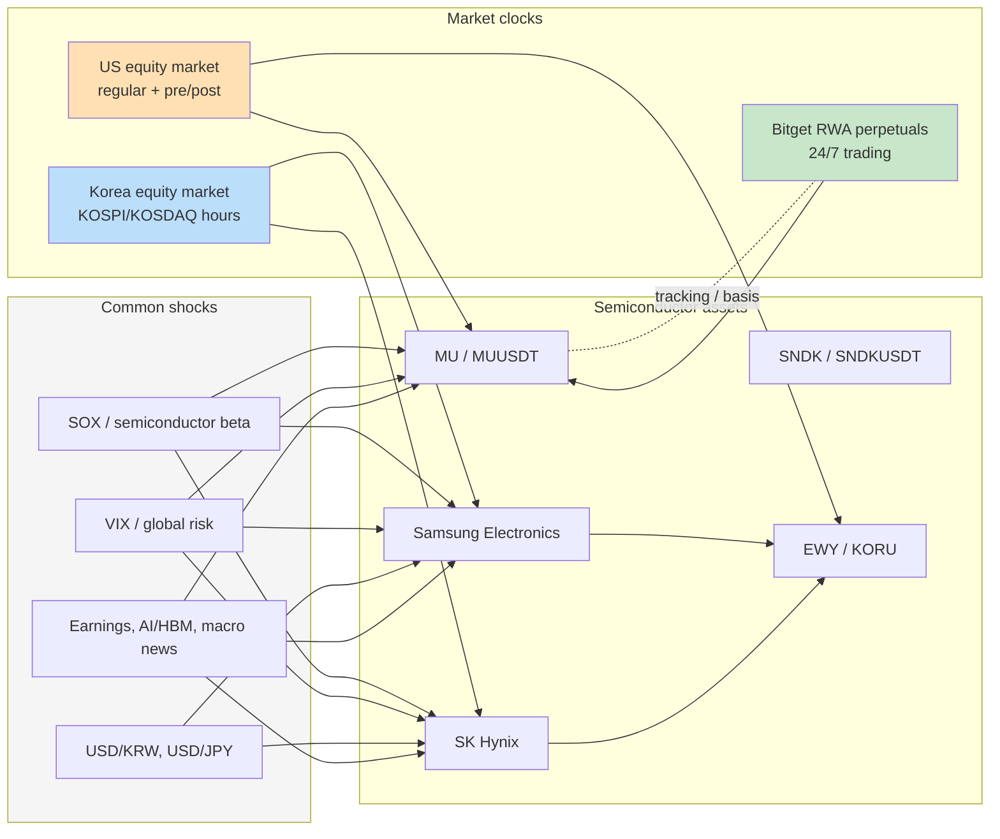
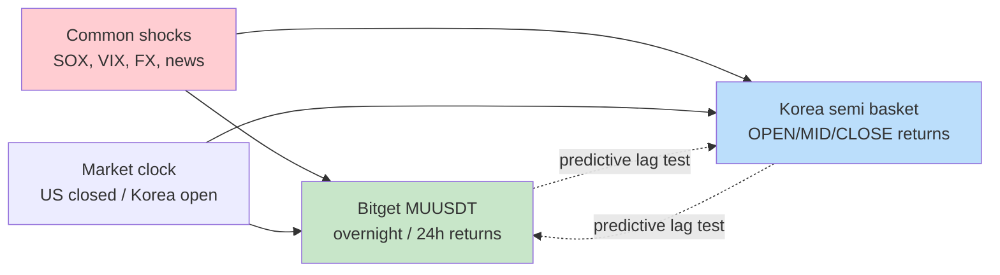
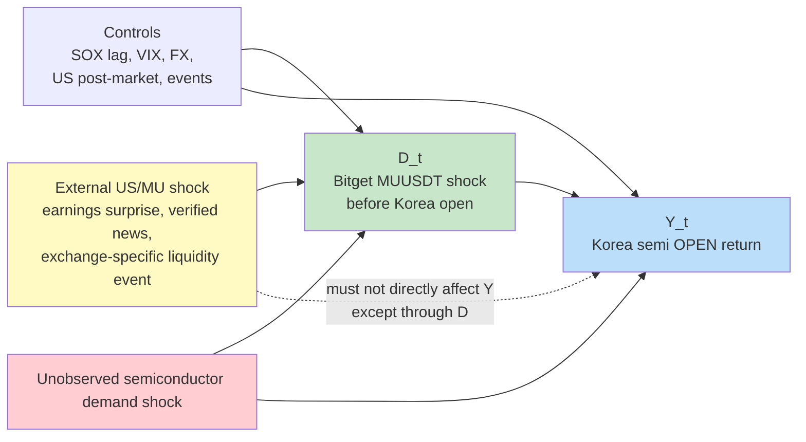
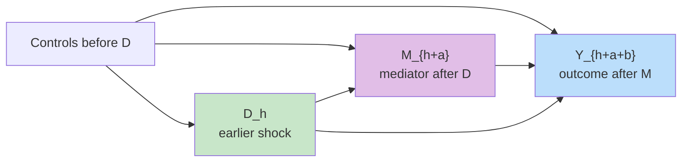

# Mermaid Research Maps

This document keeps the valuable diagram ideas while removing the invalid old causal claims.

The diagrams below are research maps, not validated causal conclusions.

## 1. Valid High-Level Idea

Value of this map:

- Bitget RWA perpetuals may provide a 24/7 price signal.
- Korea and US market clocks create measurable timing gaps.
- Semiconductor shocks must be separated from global risk and SOX beta.
- Basis/tracking quality must be validated before causal claims.

## 2. Predictive Lead-Lag Map

This is the currently defensible first-stage research object.

Allowed language:

- "Bitget predicts Korea at lag \(k\)."
- "Korea predicts Bitget at lag \(k\)."
- "The predictive relation is stronger in OPEN than MID."

Disallowed language unless a causal design is added:

- "Bitget causes Korea."
- "Korea causes MU."
- "The Granger direction establishes causality."

## 3. Candidate Reverse Causal Design

This is only a candidate. It needs an external shock before estimation.

Identification warning:

- If \(Z\) is just a transformed version of \(D\), it is invalid.
- If \(Z\) is broad semiconductor news, it likely affects Korean stocks directly and fails exclusion.
- If no valid \(Z\) exists, the study remains predictive-only.

## 4. Correct Mediation Timing

The old mediation was invalid because the mediator was measured after the outcome.

The valid time order must be:

\[
D_h \to M_{h+a} \to Y_{h+a+b}
\]

Valid candidate paths:

- Korea OPEN shock \(\to\) EWY/KORU pre-market \(\to\) US regular-session MU.
- Bitget overnight MU shock \(\to\) Korea OPEN \(\to\) EWY/KORU pre-market.

Invalid path:

- Korea \(h\) \(\to\) EWY/KORU \(h+8\) \(\to\) Bitget MU \(h+1\).
